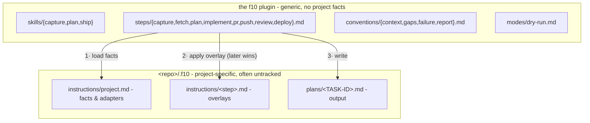

<p align="center">
  
</p>

<div align="center">

### Capture. Plan. Ship.

A language-agnostic, composable task pipeline for Claude Code: **capture → plan → ship**.

[](https://code.claude.com/docs/en/plugins)
[](LICENSE)

</div>

---

f10 (f-ten) is about consistency: three skills over one step chain. **capture** turns a raw,
freely written idea into a tracked task; **plan** turns that task into an architect-grade plan
on disk; **ship** turns the plan into code and, optionally, a release.

**Stack-agnostic**: no stack is hard-coded into the pipeline, so the same three commands drive a
Go service, a Rails app, or a Terraform repo. Point f10 at a repo and it works one of two ways.
It **infers** the facts it needs (git remote → `gh`/`glab`, build files → verify commands), or
you **declare** them once in `.f10/instructions/` - tracker, verify commands, PR flow, review
policy, guardrails - and it stops guessing.

## Pipeline


Solid arrows are the default pipeline; dashed steps run only where a project declares them.
Each skill is an **entry point** into that one chain:

| Skill | Runs | Stops at |
|---|---|---|
| `/f10:capture <desc>` | capture | task created (id + url) |
| `/f10:plan <id \| desc>` | (capture →) fetch → plan | plan file saved, before any code |
| `/f10:ship <id \| plan.md \| desc>` | whatever's missing → the ship pipeline | end of the declared pipeline (an open PR by default) |

## Install

```
/plugin marketplace add amberpixels/f10
/plugin install f10@amberpixels
```

No per-repo setup: with no `.f10/` present, steps infer what they can from the git remote and
the repo's build files. Add `.f10/instructions/project.md` to pin the facts.

## Quick Start

```text
/f10:capture Add rate limiting to the public API
# → creates the tracker task, replies with its id + url

/f10:plan ABC-1042
# → investigates the code, writes .f10/plans/ABC-1042.md, stops before any code

/f10:ship ABC-1042
# → reuses the saved plan (asks first), then runs the ship pipeline

/f10:ship fix the flaky retry test
# → or skip the ceremony: capture-plan-ship a small chore in one go
```

`--dry-run` on any skill resolves context, routing, adapters, and output paths, reports them,
and executes nothing.

## Concepts

**Pipeline mechanics**

- **Step** - the unit of work: `capture`, `fetch`, `plan`, plus the ship-pipeline steps
  `implement`, `pr`, `push`, `review`, `deploy` (`steps/*.md`). Skills are thin routers over
  steps.
- **Ship pipeline** - what `/f10:ship` runs after planning, declared in `project.md` (default
  `implement → pr`). A name with no generic step (e.g. `e2e`) is project-defined:
  `.f10/instructions/<name>.md` *is* the step. Projects may declare several **named pipelines**;
  the user picks non-default ones, never the agent, and a *(planless)* one skips ticket and plan
  file for tiny chores.
- **Convention** - a cross-cutting rule every step obeys, in `conventions/`: `context.md`
  (config loading, pipelines, stealth), `gaps.md` (open decisions), `failure.md` (what to do
  when a step cannot complete), `report.md` (the shape a successful run prints). They load as one
  fixed bundle, once per context - unlike project resolution, which reruns every run.
- **Mode** - an alternate run in `modes/` that replaces execution rather than adding a rule.
  `dry-run.md` is the only one today, loaded solely when `--dry-run` fires.

**Artifacts**

- **Task** - the tracker item. Its **task id** (project-defined format) threads through every
  step and names every artifact.
- **Stage** - one ordered unit inside a plan file. Distinct from a step, which is a pipeline
  unit, and from a skill, which is an entry point.
- **Plan file** - `<storage root>/plans/<TASK-ID>.md`, the single handoff contract between plan
  and ship. The storage root is anchored to the checkout root, so it does not matter which
  directory the agent was launched from. A plan that exists only in chat is a failed run;
  superseded plans are archived, never edited in place.
- **Gap** - an open decision only the user can make. *Recorded, not blocking*: every gap
  carries a default, so a plan is always shippable; filling them is an optional batched
  questionnaire.

**Project binding**

- **Project instructions** - `<checkout root>/.f10/instructions/`: `project.md` (the facts) plus
  optional per-step **overlays** that extend a generic step. A linked worktree's instructions
  **layer** on top of main's unless they declare `Layering - replaces main`; later wins, scope
  ahead of specificity.
- **Role** - who the agent is for a step. A base role per step, plus **conditional** roles a
  project attaches by area (`+ senior UI/UX engineer` when the task touches user-facing UI).
  Fetch settles the areas - from the task's note, or from the code when the task was too small to
  carry one - and the plan file records the roles it was written under so ship inherits them.
- **Adapter** - how a generic capability ("fetch a task", "open a PR", "verify") binds per
  project: a skill to invoke, or a plain CLI command. f10 names the capability, the project
  supplies the adapter - that is what keeps it stack-agnostic.
- **Review** - a step, local (pre-PR) or CI/human (post-PR), placed or omitted per the
  pipeline. Its absence is meaningful: no review entry → ship stops at the opened PR.
- **Visibility** - `stealth` (default) or `public`. Stealth: the shipped work reads as if f10
  never existed - no pipeline mentions in commits, PRs, tickets, or code comments, `.f10/`
  untracked via `.git/info/exclude`.
- **Storage** - `in-repo` (default, one `.f10/` per checkout, so plans sit beside the branch they
  were written against) or `out-of-tree` (`~/.f10/<project>/` holds instructions *and* plans for
  every worktree; zero f10 files inside the project dir). Out-of-tree declares itself by
  location: the loader finds it when the repo has no `.f10/instructions/`.

## Generic vs. Project-Specific



Resolution order (full contract in `conventions/context.md`): `main/project.md` →
`main/<step>.md` → `worktree/project.md` → `worktree/<step>.md` → inferred defaults, later
winning - scope ahead of specificity. A linked worktree layers on top of main's instructions,
takes them wholesale when it has none of its own, or shuts them out with
`Layering - replaces main`. Plans always land in the current worktree.

## Status line

A run happens where you cannot see it. The plan file lands on disk only at the end, the tracker
knows nothing until capture is done, and the rest scrolls past. Three glyphs in Claude Code's
[status line](https://code.claude.com/docs/en/statusline) - capture, plan, ship - say where the run
is, with the task id beside them:

```text
e@host f10  main  ●●◎ GH-14 · implement  [Opus]
                  ╰ captured, planned, now shipping - currently on the implement step
```

| glyph | phase state |
|---|---|
| `○` | pending - has not run |
| `◎` | running |
| `●` | done |
| `◌` | skipped - not this run's to do (`/f10:ship ABC-1` never captures) |
| `✗` | failed - the run stopped here |

Each state has its own **shape**, and color only reinforces it: a status line is read at a glance,
often in a daltonized theme, where red/green is exactly the pair that collapses. `NO_COLOR` and
`F10_STATE_COLOR=0` drop the color and keep the badge readable. The task id is an OSC 8 hyperlink
to the tracker wherever the run knows the url.

All five are circles-by-fill for a duller reason than legibility: a codepoint your terminal font
lacks does not fail, it is quietly substituted from some other font whose baseline is its own, and
the badge renders visibly off the line. `◐` - the obvious mark for "half done" - is missing from
JetBrains Mono, Fira Code and Hack alike, so it is not used. If a glyph still lands wrong in your
font, `F10_STATE_GLYPHS` replaces the set.

### Wiring it up

A plugin cannot ship a `statusLine` - Claude Code applies only `agent` and `subagentStatusLine`
from a plugin's settings - so this one edit to `~/.claude/settings.json` is yours to make. f10
re-points `~/.claude/f10/statusline` at its current install on every session start, so the path
below keeps working across plugin updates:

```sh
input=$(cat)                                                             # you already do this
f10=$(printf '%s' "$input" | "$HOME/.claude/f10/statusline" 2>/dev/null)  # ← add
printf '%s@%s %s%s' "$user" "$host" "$dir" "$f10"                        # ← append it anywhere
```

The segment brings its own leading space and is empty when no run is live, so it concatenates
unconditionally. On one line it competes for width with the branch, though, and a worktree on
`WS-2653-optimize-evaluation-edit-page-payload` leaves it nothing - so give it a row instead. A
status-line script can print as many rows as it likes, and printing the second one only when it
has content costs no vertical space while idle:

```sh
printf '%s@%s %s%s' "$user" "$host" "$dir"          # row 1, unchanged
if [ -n "$f10" ]; then printf '\n%s' "${f10# }"; fi  # row 2, only when a run is live
```

Use the `if` form rather than `[ -n "$f10" ] && printf …`, which would exit non-zero on every idle
render. Set `"refreshInterval": 2` on `statusLine` as well: it otherwise re-runs only when an
assistant message arrives, and a long implement step would sit on a stale glyph for minutes.
`f10-state.sh doctor` reports where state lives, whether the symlink is in place, and what the
badge renders right now.

### How it stays current

Two writers, and the split between them is deliberate:

- **Hooks** (`hooks/hooks.json`) - `UserPromptExpansion` and `PreToolUse` catch a skill starting,
  whether it was typed or the model invoked it, and read the argument to tell a description (which
  routes through capture) from a task id (which does not). `PostToolUse` catches the plan file
  being written, which is both "plan done" and where the task id comes from. `Stop` closes out
  whatever is still marked running when the turn ends. `SessionStart` prunes dead state and
  refreshes the symlink.
- **Steps** - one `f10-state.sh set` call as each phase opens and closes. The rule is in
  `conventions/report.md`: the badge is **cosmetic and best-effort**, nothing reads it back, and a
  call that fails costs a glyph and nothing else.

The steps report precisely and the hooks report reliably, and the second is why the first is
allowed to be best-effort. An instruction to write one more line *after* the pipeline, the PR and
the report is the one an agent is most likely to drop, so a run that finished would otherwise sit
on a spinning glyph until the TTL retired it. For the same reason a phase left `pending` means
"nobody said", not "it did not happen" - which is why the route is read from the argument at the
start rather than inferred from silence at the end.

State is one small file per session in `~/.claude/f10/state/`, outside every repo - stealth mode
wants nothing f10-shaped inside a project directory, not even untracked. `/clear` mints a new
session and so retires the badge; a file older than the TTL stops rendering.

| variable | default | |
|---|---|---|
| `F10_STATE_DIR` | `~/.claude/f10/state` | where state files live |
| `F10_STATE_TTL` | `86400` | seconds before a badge reads as stale |
| `F10_STATE_COLOR` | `1` | `0` (or `NO_COLOR`) for shapes without color |
| `F10_STATE_LINK` | `1` | `0` to drop the hyperlink on the task id |
| `F10_STATE_GLYPHS` | `○ ◎ ● ◌ ✗` | pending, running, done, skipped, failed |

Unrelated to f10 but pairs with it:
[`footerLinksRegexes`](https://code.claude.com/docs/en/settings#footer-link-badges) turns a task id
appearing in a reply into a clickable footer badge - one regex per tracker, no script at all.

## Development

f10's executable surface is `bin/`: `conventions.sh` cats the four convention files and nothing
else, `resolve.sh` resolves one repo's instructions, `f10-state.sh` records where a run is for the
status line to draw. The line between the first two is static vs. resolved - one is identical
everywhere and loads once per context, the other varies by repo and worktree and reruns every run.
The third is on neither side of it: it writes, and nothing in the pipeline reads it back. All are
linted with [shellcheck](https://www.shellcheck.net)
(correctness) and [shfmt](https://github.com/mvdan/sh) (formatting). The justfile is generated by
[justx](https://github.com/amberpixels/just-x); recipes inside `# >>> justx:` fences are managed,
anything outside them is yours.

```bash
just lint   # report findings, change nothing (this is what CI runs)
just fmt    # rewrite to canonical form
just fix    # apply shellcheck's auto-fixable findings - run on a clean tree, read the diff
```

Scripts are discovered by `shfmt -f`, which matches on extension *and* shebang, so a new
`bin/whatever` is covered the moment it exists. Enabled shellcheck optionals - and the ones
deliberately left off - are documented in `.shellcheckrc`.

## Status

v0.8.0 - a **status-line badge**. Three glyphs - capture, plan, ship - plus the task id, live in
Claude Code's status line while a run is going, so a pipeline stops being invisible between the
prompt and the plan file. Steps report their phase through `bin/f10-state.sh`, and plugin hooks
fill in what nobody should have to remember: a skill starting, a plan file being written, and the
task id that file is named after. State is one file per session, outside every repo, and the badge
is cosmetic by construction - nothing reads it back, so a call that fails costs one glyph and
nothing else (`conventions/report.md`). Also: the marketplace entry no longer resolves with a
trailing slash, so `${CLAUDE_PLUGIN_ROOT}` stops printing `//` in every path f10 runs.
Builds on v0.7.0's report convention, worktree layering, and split context loading.
Next: `/f10:init` (bootstrap questionnaire + shared **profiles** - named configs a repo's
`project.md` references instead of repeating).

## Feedback

A solo, opinionated project - but ideas, questions, and bug reports are always welcome as an
[issue](https://github.com/amberpixels/f10/issues) :)

## License

[MIT](LICENSE) © [amberpixels](https://amberpixels.io)
