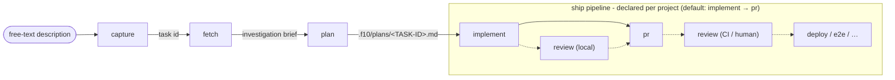
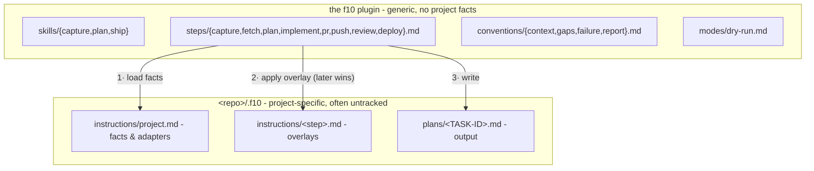

<p align="center">
  
</p>

<div align="center">

### Capture. Plan. Ship.

A language-agnostic, composable task pipeline for Claude Code: **capture → plan → ship**.

[](https://code.claude.com/docs/en/plugins)
[](LICENSE)

</div>

---

f10 (f-ten) is about consistency: three skills over one step chain. **capture** turns a raw,
freely written idea into a tracked task; **plan** turns that task into an architect-grade plan
on disk; **ship** turns the plan into code and, optionally, a release.

**Stack-agnostic**: no stack is hard-coded into the pipeline, so the same three commands drive a
Go service, a Rails app, or a Terraform repo. Point f10 at a repo and it works one of two ways.
It **infers** the facts it needs (git remote → `gh`/`glab`, build files → verify commands), or
you **declare** them once in `.f10/instructions/` - tracker, verify commands, PR flow, review
policy, guardrails - and it stops guessing.

## Pipeline



Solid arrows are the default pipeline; dashed steps run only where a project declares them.
Each skill is an **entry point** into that one chain:

| Skill | Runs | Stops at |
|---|---|---|
| `/f10:capture <desc>` | capture | task created (id + url) |
| `/f10:plan <id \| desc>` | (capture →) fetch → plan | plan file saved, before any code |
| `/f10:ship <id \| plan.md \| desc>` | whatever's missing → the ship pipeline | end of the declared pipeline (an open PR by default) |

## Install

```
/plugin marketplace add amberpixels/f10
/plugin install f10@amberpixels
```

No per-repo setup: with no `.f10/` present, steps infer what they can from the git remote and
the repo's build files. Add `.f10/instructions/project.md` to pin the facts.

## Quick Start

```text
/f10:capture Add rate limiting to the public API
# → creates the tracker task, replies with its id + url

/f10:plan ABC-1042
# → investigates the code, writes .f10/plans/ABC-1042.md, stops before any code

/f10:ship ABC-1042
# → reuses the saved plan (asks first), then runs the ship pipeline

/f10:ship fix the flaky retry test
# → or skip the ceremony: capture-plan-ship a small chore in one go
```

`--dry-run` on any skill resolves context, routing, adapters, and output paths, reports them,
and executes nothing.

## Concepts

**Pipeline mechanics**

- **Step** - the unit of work: `capture`, `fetch`, `plan`, plus the ship-pipeline steps
  `implement`, `pr`, `push`, `review`, `deploy` (`steps/*.md`). Skills are thin routers over
  steps.
- **Ship pipeline** - what `/f10:ship` runs after planning, declared in `project.md` (default
  `implement → pr`). A name with no generic step (e.g. `e2e`) is project-defined:
  `.f10/instructions/<name>.md` *is* the step. Projects may declare several **named pipelines**;
  the user picks non-default ones, never the agent, and a *(planless)* one skips ticket and plan
  file for tiny chores.
- **Convention** - a cross-cutting rule every step obeys, in `conventions/`: `context.md`
  (config loading, pipelines, stealth), `gaps.md` (open decisions), `failure.md` (what to do
  when a step cannot complete), `report.md` (the shape a successful run prints). They load as one
  fixed bundle, once per context - unlike project resolution, which reruns every run.
- **Mode** - an alternate run in `modes/` that replaces execution rather than adding a rule.
  `dry-run.md` is the only one today, loaded solely when `--dry-run` fires.

**Artifacts**

- **Task** - the tracker item. Its **task id** (project-defined format) threads through every
  step and names every artifact.
- **Stage** - one ordered unit inside a plan file. Distinct from a step, which is a pipeline
  unit, and from a skill, which is an entry point.
- **Plan file** - `<storage root>/plans/<TASK-ID>.md`, the single handoff contract between plan
  and ship. The storage root is anchored to the checkout root, so it does not matter which
  directory the agent was launched from. A plan that exists only in chat is a failed run;
  superseded plans are archived, never edited in place.
- **Gap** - an open decision only the user can make. *Recorded, not blocking*: every gap
  carries a default, so a plan is always shippable; filling them is an optional batched
  questionnaire.

**Project binding**

- **Project instructions** - `<checkout root>/.f10/instructions/`: `project.md` (the facts) plus
  optional per-step **overlays** that extend a generic step. A linked worktree's instructions
  **layer** on top of main's unless they declare `Layering - replaces main`; later wins, scope
  ahead of specificity.
- **Role** - who the agent is for a step. A base role per step, plus **conditional** roles a
  project attaches by area (`+ senior UI/UX engineer` when the task touches user-facing UI).
  Fetch settles the areas - from the task's note, or from the code when the task was too small to
  carry one - and the plan file records the roles it was written under so ship inherits them.
- **Adapter** - how a generic capability ("fetch a task", "open a PR", "verify") binds per
  project: a skill to invoke, or a plain CLI command. f10 names the capability, the project
  supplies the adapter - that is what keeps it stack-agnostic.
- **Review** - a step, local (pre-PR) or CI/human (post-PR), placed or omitted per the
  pipeline. Its absence is meaningful: no review entry → ship stops at the opened PR.
- **Visibility** - `stealth` (default) or `public`. Stealth: the shipped work reads as if f10
  never existed - no pipeline mentions in commits, PRs, tickets, or code comments, `.f10/`
  untracked via `.git/info/exclude`.
- **Storage** - `in-repo` (default, one `.f10/` per checkout, so plans sit beside the branch they
  were written against) or `out-of-tree` (`~/.f10/<project>/` holds instructions *and* plans for
  every worktree; zero f10 files inside the project dir). Out-of-tree declares itself by
  location: the loader finds it when the repo has no `.f10/instructions/`.

## Generic vs. Project-Specific



Resolution order (full contract in `conventions/context.md`): `main/project.md` →
`main/<step>.md` → `worktree/project.md` → `worktree/<step>.md` → inferred defaults, later
winning - scope ahead of specificity. A linked worktree layers on top of main's instructions,
takes them wholesale when it has none of its own, or shuts them out with
`Layering - replaces main`. Plans always land in the current worktree.

## Development

f10's executable surface is `bin/`: `conventions.sh` cats the four convention files and nothing
else, `resolve.sh` resolves one repo's instructions. The line between them is static vs. resolved -
the first is identical everywhere and loads once per context, the second varies by repo and
worktree and reruns every run. Both are linted with [shellcheck](https://www.shellcheck.net)
(correctness) and [shfmt](https://github.com/mvdan/sh) (formatting). The justfile is generated by
[justx](https://github.com/amberpixels/just-x); recipes inside `# >>> justx:` fences are managed,
anything outside them is yours.

```bash
just lint   # report findings, change nothing (this is what CI runs)
just fmt    # rewrite to canonical form
just fix    # apply shellcheck's auto-fixable findings - run on a clean tree, read the diff
```

Scripts are discovered by `shfmt -f`, which matches on extension *and* shebang, so a new
`bin/whatever` is covered the moment it exists. Enabled shellcheck optionals - and the ones
deliberately left off - are documented in `.shellcheckrc`.

## Status

v0.7.0 - a **report** convention: every successful run opens with the same yaml-tagged facts
block, urls bare with a `↗` marker in the column beside them. Context loading splits in two -
`conventions.sh` once per context, `resolve.sh` every run - so `/f10:ship` resolves `--all`
instead of naming a pipeline it cannot know yet. A linked worktree's instructions now **layer**
on top of main's, the storage root anchors to the checkout root rather than the process cwd,
capture sizes a task body to the task, and the host comes from your `gh`/`glab` logins, so GitHub
Enterprise and self-hosted GitLab need no allowlist. Shell sources are linted in CI.
Builds on v0.6.0's conditional roles and one word per concept: **skill** → **step** → **stage**.
Next: `/f10:init` (bootstrap questionnaire + shared **profiles** - named configs a repo's
`project.md` references instead of repeating).

## Feedback

A solo, opinionated project - but ideas, questions, and bug reports are always welcome as an
[issue](https://github.com/amberpixels/f10/issues) :)

## License

[MIT](LICENSE) © [amberpixels](https://amberpixels.io)
