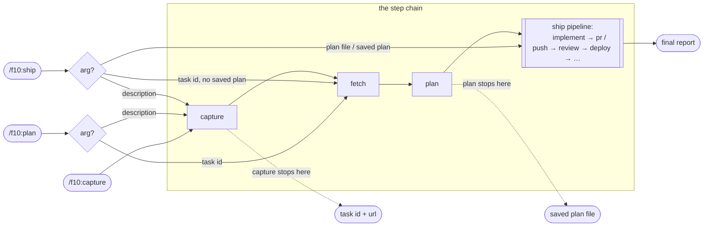
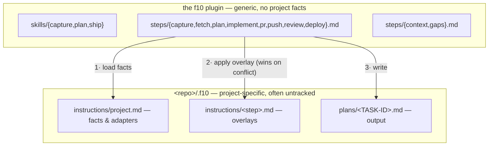

# f10 (f-ten)

A generic, composable task pipeline for Claude Code: **capture → plan → ship**.
Take a one-line idea to a tracker task, an architect-grade plan, and a reviewed PR — in any
repo, with all project specifics living on the repo's side.

## Pipeline

Solid arrows are the default pipeline; dashed steps run only where a project declares them.

Three skills are just **entry points** into that chain:

| Skill | Runs | Stops at |
|---|---|---|
| `/f10:capture <desc>` | capture | task created (id + url) |
| `/f10:plan <id \| desc>` | (capture →) fetch → plan | plan file saved, before any code |
| `/f10:ship <id \| plan.md \| desc>` | whatever's missing → the ship pipeline | end of the project's declared pipeline (an open PR by default) |

Each skill routes by its argument: a task id skips capture; a plan-file path skips straight to
implement; ship reuses an existing plan file (asking first) or plans fresh.

### Skills × steps

Skills don't own steps — all three are entry points into **one step chain**, differing only in
where they enter (routed by the argument) and where they stop:

(Not drawn: `/f10:plan` with no argument but a task already discussed in chat enters directly
at the plan step; ship finding a saved plan asks *reuse or re-plan* before skipping ahead;
a *(planless)* pipeline lets ship jump from a tiny free-text description straight to the
pipeline.)

## Concepts

**Pipeline mechanics**

- **Step** — the unit of work: `capture`, `fetch`, `plan`, plus the ship-pipeline steps
  `implement`, `pr`, `push`, `review`, `deploy` (`steps/*.md`). Skills are thin routers over
  steps; the capture and plan skills share their step's name (1:1), while ship runs the whole
  pipeline.
- **Ship pipeline** — the ordered steps `/f10:ship` runs after planning, declared per project
  in `project.md` (default `implement → pr`). A name with no generic step (e.g. `e2e`) is a
  project-defined step: `.f10/instructions/<name>.md` *is* the step. Projects may declare
  several **named pipelines** (`default`, `direct: implement → push`, …) — the user selects
  non-default ones, never the agent; a *(planless)* pipeline skips ticket + plan file for
  tiny free-text chores.
- **Convention** — a cross-cutting rule file steps obey: `steps/context.md` (project config
  loading, ship pipeline, stealth), `steps/gaps.md` (open decisions), `steps/dry-run.md`
  (resolve-and-report, execute nothing).
- **Dry run** — add `--dry-run` to any skill's argument (`/f10:plan --dry-run 1042`) to resolve
  the full context, routing, adapters, overlays, and output paths and *report* them without
  executing — no fetch, write, task, PR, or deploy. Makes the otherwise-invisible resolution
  auditable; the per-repo validation harness for inferred defaults (see `steps/dry-run.md`).

**Artifacts**

- **Task** — the tracker item. Its **task id** (project-defined format: `ABC-####`, `GH-###`,
  …) threads through every stage and names every artifact.
- **Plan file** — `.f10/plans/<TASK-ID>.md`. The single handoff contract between plan and
  ship. A plan that exists only in chat is a failed run; superseded plans are archived to
  `.f10/plans/archive/`, never edited in place.
- **Gap** — an open decision only the user can make. *Recorded, not blocking*: every gap
  carries a default, so a plan is always shippable; filling gaps is an optional batched
  questionnaire; resolved gaps stay in the file as an audit trail.

**Project binding**

- **Project instructions** — `<repo>/.f10/instructions/`: `project.md` (the facts) plus
  optional per-step **overlays** (`plan.md`, `implement.md`, …) that extend a generic step
  and win on conflict.
- **Adapter** — how a generic capability ("fetch a task", "open a PR") is bound per project:
  a skill to invoke, or a plain CLI command (`gh` / `glab`). f10 defines the ports; the
  project supplies the adapters.
- **Review** — a pipeline step, local (pre-PR) or external/CI/human (post-PR), placed — or
  absent — per the ship pipeline. Its absence is meaningful: no review entry → ship stops at
  the opened PR.
- **Visibility** — `stealth` (default) or `public`. Stealth: the shipped work must read as if
  f10 never existed — no pipeline mentions in commits, PRs, tickets, or code comments, and
  `.f10/` stays untracked via `.git/info/exclude`.
- **Storage** — where a project's f10 files live: `in-repo` (default — `<repo>/.f10/`,
  untracked per visibility) or `out-of-tree` (`~/.f10/<project>/` holds instructions *and*
  plans; zero f10 files inside the project dir — for when even an untracked dir is too
  visible). Out-of-tree declares itself by location: the context loader finds it when the
  repo has no `.f10/instructions/`.
- **Profile** *(planned)* — a named shared config in the plugin that a repo's `project.md`
  references (`profile: amberpixels-go-lib`) instead of repeating. See the `/f10:init` plan.

## Generic vs. project-specific

Resolution order (full contract in `steps/context.md`): the repo's `project.md` → per-step
overlay → inferred defaults when nothing exists (remote host, stack files, justfile/Makefile).
In a git worktree with no local instructions, fall back to the main checkout's — plans still
land in the current worktree. Neither checkout has instructions → try out-of-tree storage at
`~/.f10/<project>/` before inferring.

## Status

v0.4.0 — standalone repo (installed as a Claude Code plugin via its own marketplace; all
internal references go through `${CLAUDE_PLUGIN_ROOT}`); per-project **storage** modes
(in-repo / out-of-tree). Earlier: v0.3.0 decoupled the pipeline from its original host
project (generic steps + per-repo instructions) and split ship into a per-project pipeline.
Next: `/f10:init` (bootstrap questionnaire + shared profiles).
