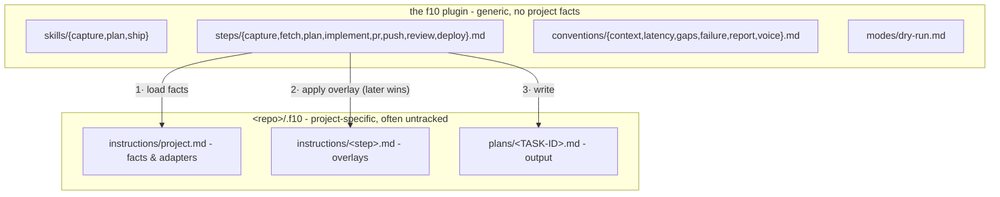

<p align="center">
  
</p>

<div align="center">

### Capture. Plan. Ship.

A language-agnostic, composable task pipeline for Claude Code: **capture → plan → ship**.

[](https://code.claude.com/docs/en/plugins)
[](LICENSE)

</div>

---

f10 (f-ten) is three skills over one step chain. **capture** turns a freely written idea into a
tracked task; **plan** turns that task into an architect-grade plan on disk; **ship** turns the
plan into code and, optionally, a release.

No stack is hard-coded, so the same three commands drive a Go service, a Rails app, or a Terraform
repo. f10 either **infers** what it needs (git remote → `gh`/`glab`, build files → verify commands)
or you **declare** it once in `.f10/instructions/` and it stops guessing.

## Pipeline


Solid arrows are the default pipeline; dashed steps run only where a project declares them. Each
skill is an **entry point** into that chain:

| Skill | Runs | Stops at |
|---|---|---|
| `/f10:capture <desc>` | capture | task created (id + url) |
| `/f10:plan <id \| desc>` | (capture →) fetch → plan | plan file saved, before any code |
| `/f10:ship <id \| plan.md \| desc>` | whatever's missing → the ship pipeline | end of the declared pipeline (an open PR by default) |

## Install

```
/plugin marketplace add amberpixels/f10
/plugin install f10@amberpixels
```

No per-repo setup. With no `.f10/` present, steps infer what they can from the git remote and the
repo's build files. Add `.f10/instructions/project.md` to pin the facts.

## Quick start

```text
/f10:capture Add rate limiting to the public API
# → creates the tracker task, replies with its id + url

/f10:plan ABC-1042
# → investigates the code, writes .f10/plans/ABC-1042.md, stops before any code

/f10:ship ABC-1042
# → reuses the saved plan (asks first), then runs the ship pipeline

/f10:ship fix the flaky retry test
# → or skip the ceremony: capture-plan-ship a small chore in one go
```

`--dry-run` on any skill resolves context, routing, adapters, and output paths, reports them, and
executes nothing.

## Concepts

**Pipeline**

- **Step** - the unit of work: `capture`, `fetch`, `plan`, plus ship-pipeline steps `implement`,
  `pr`, `push`, `review`, `deploy` (`steps/*.md`). Skills are thin routers over steps.
- **Ship pipeline** - what `/f10:ship` runs after planning, declared in `project.md` (default
  `implement → pr`). A name with no generic step (e.g. `e2e`) is project-defined:
  `.f10/instructions/<name>.md` *is* the step. A project may declare several **named pipelines**;
  the user picks non-default ones, never the agent. A *(planless)* one skips ticket and plan file.
- **Convention** - a cross-cutting rule every step obeys, in `conventions/`: `context.md` (config
  loading, pipelines, stealth), `latency.md` (turns, not commands), `gaps.md` (open decisions),
  `failure.md` (a step that cannot complete), `report.md` (what a success prints), `voice.md` (how
  it talks). They load as one fixed bundle, once per context, unlike project resolution, which
  reruns every run.
- **Mode** - an alternate run in `modes/` that replaces execution rather than adding a rule.
  `dry-run.md` is the only one, loaded when `--dry-run` fires.

**Artifacts**

- **Task** - the tracker item. Its **task id** threads through every step and names every artifact.
- **Stage** - one ordered unit inside a plan file. Not a step (a pipeline unit), not a skill (an
  entry point).
- **Plan file** - `<storage root>/plans/<TASK-ID>.md`, the handoff contract between plan and ship.
  The storage root is anchored to the checkout root, so the launch directory does not matter. A
  plan that exists only in chat is a failed run; superseded plans are archived, never edited.
- **Gap** - an open decision only the user can make. Recorded, not blocking: every gap carries a
  default, so a plan is always shippable. Filling them is an optional batched questionnaire.

**Project binding**

- **Project instructions** - `<checkout root>/.f10/instructions/`: `project.md` (the facts) plus
  optional per-step **overlays** that extend a generic step. A linked worktree's instructions layer
  on top of main's unless they declare `Layering - replaces main`.
- **Role** - who the agent is for a step. A base role per step, plus **conditional** roles a
  project attaches by area (`+ senior UI/UX engineer` when the task touches user-facing UI). Fetch
  settles the areas, from the task's note or from the code; the plan file records them so ship
  inherits them.
- **Adapter** - how a generic capability ("fetch a task", "open a PR", "verify") binds per project:
  a skill to invoke, or a plain CLI command. f10 names the capability, the project supplies the
  adapter. That is what keeps it stack-agnostic.
- **Review** - a step, local (pre-PR) or CI/human (post-PR), placed or omitted per pipeline. Its
  absence is meaningful: no review entry means ship stops at the opened PR.
- **Visibility** - `stealth` (default) or `public`. Stealth ships work that reads as if f10 never
  existed: no pipeline mentions in commits, PRs, tickets, or code comments, `.f10/` untracked via
  `.git/info/exclude`.
- **Storage** - `in-repo` (default: one `.f10/` per checkout, so plans sit beside the branch they
  were written against) or `out-of-tree` (`~/.f10/<project>/` holds instructions *and* plans for
  every worktree, zero f10 files inside the project dir). Out-of-tree declares itself by location:
  the loader finds it when the repo has no `.f10/instructions/`.

## Generic vs. project-specific



Resolution order (full contract in `conventions/context.md`): generic step → `main/project.md` →
`main/<step>.md` → `worktree/project.md` → `worktree/<step>.md` → inferred defaults. Later wins,
scope ahead of specificity. It all arrives in one bundle, generic step files included, so a run
never reads `steps/` by hand. A linked worktree layers on top of main's instructions, takes them
wholesale when it has none of its own, or shuts them out with `Layering - replaces main`. Plans
always land in the current worktree.

## Status line

A run happens where you cannot see it: the plan file lands only at the end, the tracker knows
nothing until capture is done, the rest scrolls past. Three glyphs in Claude Code's
[status line](https://code.claude.com/docs/en/statusline) say where the run is, behind an F10
keycap icon (`󱊴`) that says whose circles they are:

```text
e@host 󱊴 ●●◎ f10  main [Opus]
       ╰ captured, planned, now shipping
```

| glyph | phase state |
|---|---|
| `○` | pending - has not run |
| `◎` | running |
| `●` | done |
| `◉` | prior - done before this run (`/f10:ship ABC-1` reusing a saved plan) |
| `◌` | skipped - will not happen this run (a planless pipeline never plans) |
| `󰅚` | partial - stopped, but work survived (committed but push failed, PR open but CI red) |
| `✗` | failed - the run stopped here with nothing usable |

Each state has its own shape and color only reinforces it, because a status line is read at a
glance, often in a daltonized theme where red/green is exactly the pair that collapses. `NO_COLOR`
and `F10_STATE_COLOR=0` drop the color and keep the badge readable. The task id and the running
ship step live in `f10-state.sh show`, for the human who wants the detail.

<details>
<summary>Why circles-by-fill, and the two Nerd Font exceptions</summary>

A codepoint your terminal font lacks does not fail. It is quietly substituted from another font
whose baseline is its own, and the badge renders visibly off the line. `◐`, the obvious mark for
"half done", is missing from JetBrains Mono, Fira Code and Hack alike, so it is not used. If a
glyph still lands wrong in your font, `F10_STATE_GLYPHS` replaces the set.

Two glyphs are deliberate exceptions, both Material Design icons only
[Nerd Fonts](https://www.nerdfonts.com) carry: the label `md-keyboard_f10` (U+F12B4), a whole F10
keycap in a single cell, and partial's `md-close-circle-outline` (U+F015A), because no
crossed-circle codepoint exists across those same common fonts (`⊗` is absent from Fira Code).
Both are a bet that a terminal dense enough to want this badge is already on a patched font. On
anything else each degrades to one substituted or tofu cell, and the circles beside them still
read.

</details>

### Wiring it up

A plugin cannot ship a `statusLine`, since Claude Code applies only `agent` and
`subagentStatusLine` from a plugin's settings, so this one edit to `~/.claude/settings.json` is
yours to make. f10 re-points `~/.claude/f10/statusline` at its current install on every session
start, so the path below keeps working across plugin updates:

```sh
input=$(cat)                                                             # you already do this
f10=$(printf '%s' "$input" | "$HOME/.claude/f10/statusline" 2>/dev/null)  # ← add
printf '%s@%s%s %s' "$user" "$host" "$f10" "$dir"                        # ← drop it in anywhere
```

The segment brings its own leading space and is empty when no run is live, so it concatenates
unconditionally. At a label plus three glyphs it is narrow enough to sit anywhere, even between
`user@host` and the directory, without crowding the branch.

Set `"refreshInterval": 2` on `statusLine` as well: it otherwise re-runs only when an assistant
message arrives, and a long implement step would sit on a stale glyph for minutes.
`f10-state.sh doctor` reports where state lives, whether the symlink is in place, and what the
badge renders right now.

State is one small file per session in `~/.claude/f10/state/`, outside every repo, because stealth
mode wants nothing f10-shaped inside a project directory, not even untracked. `/clear` mints a new
session and so retires the badge; a file older than the TTL stops rendering.

| variable | default | |
|---|---|---|
| `F10_STATE_DIR` | `~/.claude/f10/state` | where state files live |
| `F10_STATE_TTL` | `86400` | seconds before a badge reads as stale |
| `F10_STATE_COLOR` | `1` | `0` (or `NO_COLOR`) for shapes without color |
| `F10_STATE_LINK` | `1` | `0` to drop the hyperlink on the task id |
| `F10_STATE_GLYPHS` | `○ ◎ ● ◌ ✗ ◉ 󰅚` | pending, running, done, skipped, failed, prior, partial |

<details>
<summary>How the badge stays current: two writers</summary>

- **Hooks** (`hooks/hooks.json`) - `UserPromptExpansion` and `PreToolUse` catch a skill starting,
  whether it was typed or the model invoked it, and read the argument to tell a description (which
  routes through capture) from a task id (which does not). `PostToolUse` catches the plan file
  being written, which is both "plan done" and where the task id comes from. `Stop` closes out
  whatever is still marked running when the turn ends. `SessionStart` prunes dead state and
  refreshes the symlink.
- **Steps** - one `f10-state.sh set` call as each phase opens and closes. Per
  `conventions/report.md` the badge is **cosmetic and best-effort**: nothing reads it back, and a
  call that fails costs a glyph and nothing else.

The steps report precisely and the hooks report reliably, and the second is why the first is
allowed to be best-effort. An instruction to write one more line *after* the pipeline, the PR and
the report is the one an agent is most likely to drop, so a run that finished would otherwise sit
on a spinning glyph until the TTL retired it. For the same reason a phase left `pending` means
"nobody said", not "it did not happen", which is why the route is read from the argument at the
start rather than inferred from silence at the end.

</details>

Unrelated to f10 but pairs with it:
[`footerLinksRegexes`](https://code.claude.com/docs/en/settings#footer-link-badges) turns a task id
appearing in a reply into a clickable footer badge - one regex per tracker, no script at all.

## Development

f10's executable surface is `bin/`: `conventions.sh` cats the six convention files, `resolve.sh`
resolves one repo's instructions, `f10-state.sh` records where a run is for the status line to
draw. The first two split on static vs. resolved: one is identical everywhere and loads once per
context, the other varies by repo and worktree and reruns every run. The third is on neither side,
because it writes and nothing in the pipeline reads it back.

```bash
just lint   # report findings, change nothing (this is what CI runs)
just fmt    # rewrite to canonical form
just fix    # apply shellcheck's auto-fixable findings - run on a clean tree, read the diff
```

Linting is [shellcheck](https://www.shellcheck.net) for correctness and
[shfmt](https://github.com/mvdan/sh) for formatting. Scripts are discovered by `shfmt -f`, which
matches on extension *and* shebang, so a new `bin/whatever` is covered the moment it exists.
Enabled shellcheck optionals, and the ones deliberately left off, are documented in
`.shellcheckrc`. The justfile is generated by [justx](https://github.com/amberpixels/just-x);
recipes inside `# >>> justx:` fences are managed, anything outside them is yours.

## Status

**v0.14.0 - the user watched the run happen.** Every facts block a run prints was specified; the
sentences around them were not. `voice.md`, a sixth always-loaded convention, governs that prose.
It leads with one test - cut every clause that would still be true if the topic changed - and
names the eight forms the test catches, from frame markers and codas down to nominalization and
pleonasm. The task body and the plan file are exempt from the first four, since they are read
later by someone who was not in the session. `latency.md` is rewritten rule-first as the specimen
for the same pass over the remaining prompt files. Two documentation bugs fell out of it:
`F10_STATE_GLYPHS` listed five of its seven glyphs, so an override from the README silently lost
`prior` and `partial`, and `conventions.sh` was described as catting five files. Builds on v0.13's
turn-cost work.

Next: `/f10:init` (bootstrap questionnaire + shared **profiles**, named configs a repo's
`project.md` references instead of repeating).

## Feedback

A solo, opinionated project, but ideas, questions, and bug reports are always welcome as an
[issue](https://github.com/amberpixels/f10/issues) :)

## License

[MIT](LICENSE) © [amberpixels](https://amberpixels.io)
