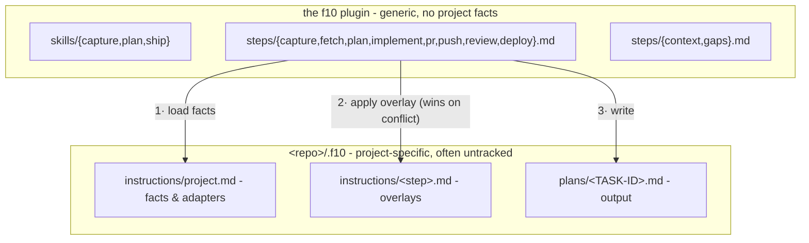

<p align="center">
  
</p>

<div align="center">

### Capture. Plan. Ship.

A language-agnostic, composable task pipeline for Claude Code: **capture → plan → ship**.

[](https://code.claude.com/docs/en/plugins)
[](LICENSE)

</div>

---

f10 (f-ten) is about consistency: three skills over one step chain. **capture** turns a raw,
freely written idea into a tracked task; **plan** turns that task into an architect-grade plan
on disk; **ship** turns the plan into code and, optionally, a release.

**Stack-agnostic by construction**: the pipeline is pure process, with no knowledge of any
language, framework, or toolchain. Every project fact - tracker, verify commands, PR flow,
review policy, guardrails - lives on the repo's side in `.f10/instructions/`, so the same three
commands drive a Go service, a Rails app, or a Terraform repo.

## Pipeline


Solid arrows are the default pipeline; dashed steps run only where a project declares them.
Each skill is an **entry point** into that one chain:

| Skill | Runs | Stops at |
|---|---|---|
| `/f10:capture <desc>` | capture | task created (id + url) |
| `/f10:plan <id \| desc>` | (capture →) fetch → plan | plan file saved, before any code |
| `/f10:ship <id \| plan.md \| desc>` | whatever's missing → the ship pipeline | end of the declared pipeline (an open PR by default) |

## Install

```
/plugin marketplace add amberpixels/f10
/plugin install f10@amberpixels
```

No per-repo setup: with no `.f10/` present, steps infer what they can from the git remote and
the repo's build files. Add `.f10/instructions/project.md` to pin the facts.

## Quick Start

```text
/f10:capture Add rate limiting to the public API
# → creates the tracker task, replies with its id + url

/f10:plan ABC-1042
# → investigates the code, writes .f10/plans/ABC-1042.md, stops before any code

/f10:ship ABC-1042
# → reuses the saved plan (asks first), then runs the ship pipeline

/f10:ship fix the flaky retry test
# → or skip the ceremony: capture-plan-ship a small chore in one go
```

`--dry-run` on any skill resolves context, routing, adapters, and output paths, reports them,
and executes nothing.

## Concepts

**Pipeline mechanics**

- **Step** - the unit of work: `capture`, `fetch`, `plan`, plus the ship-pipeline steps
  `implement`, `pr`, `push`, `review`, `deploy` (`steps/*.md`). Skills are thin routers over
  steps.
- **Ship pipeline** - what `/f10:ship` runs after planning, declared in `project.md` (default
  `implement → pr`). A name with no generic step (e.g. `e2e`) is project-defined:
  `.f10/instructions/<name>.md` *is* the step. Projects may declare several **named pipelines**;
  the user picks non-default ones, never the agent, and a *(planless)* one skips ticket and plan
  file for tiny chores.
- **Convention** - a cross-cutting rule file every step obeys: `context.md` (config loading,
  pipelines, stealth), `gaps.md`, `dry-run.md`.

**Artifacts**

- **Task** - the tracker item. Its **task id** (project-defined format) threads through every
  stage and names every artifact.
- **Plan file** - `.f10/plans/<TASK-ID>.md`, the single handoff contract between plan and ship.
  A plan that exists only in chat is a failed run; superseded plans are archived, never edited
  in place.
- **Gap** - an open decision only the user can make. *Recorded, not blocking*: every gap
  carries a default, so a plan is always shippable; filling them is an optional batched
  questionnaire.

**Project binding**

- **Project instructions** - `<repo>/.f10/instructions/`: `project.md` (the facts) plus
  optional per-step **overlays** that extend a generic step and win on conflict.
- **Adapter** - how a generic capability ("fetch a task", "open a PR", "verify") binds per
  project: a skill to invoke, or a plain CLI command. f10 defines the ports, the project
  supplies the adapters - that is what keeps it stack-agnostic.
- **Review** - a step, local (pre-PR) or CI/human (post-PR), placed or omitted per the
  pipeline. Its absence is meaningful: no review entry → ship stops at the opened PR.
- **Visibility** - `stealth` (default) or `public`. Stealth: the shipped work reads as if f10
  never existed - no pipeline mentions in commits, PRs, tickets, or code comments, `.f10/`
  untracked via `.git/info/exclude`.
- **Storage** - `in-repo` (default) or `out-of-tree` (`~/.f10/<project>/` holds instructions
  *and* plans; zero f10 files inside the project dir). Out-of-tree declares itself by location:
  the loader finds it when the repo has no `.f10/instructions/`.

## Generic vs. Project-Specific



Resolution order (full contract in `steps/context.md`): the repo's `project.md` → per-step
overlay → inferred defaults. A worktree with no local instructions falls back to the main
checkout's; plans still land in the current worktree.

## Status

v0.4.0 - standalone plugin repo with per-project storage modes (in-repo / out-of-tree).
Next: `/f10:init` (bootstrap questionnaire + shared **profiles** - named configs a repo's
`project.md` references instead of repeating).

## Feedback

A solo, opinionated project - but ideas, questions, and bug reports are always welcome as an
[issue](https://github.com/amberpixels/f10/issues) :)

## License

[MIT](LICENSE) © [amberpixels](https://amberpixels.io)
