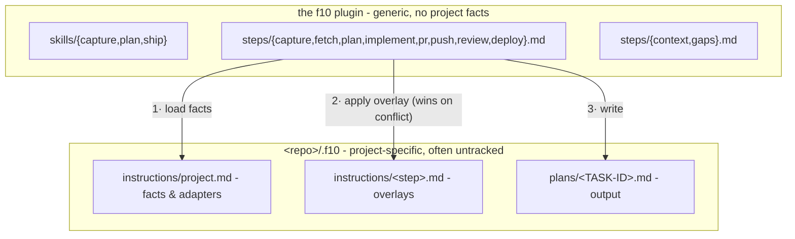

<p align="center">
  
</p>

<div align="center">

### Capture. Plan. Ship.

A generic, composable task pipeline for Claude Code: **capture → plan → ship**.

[](https://code.claude.com/docs/en/plugins)
[](LICENSE)

</div>

---

f10 (f-ten) takes a one-line idea to a tracker task, an architect-grade plan, and a reviewed
PR - in any repo. The pipeline itself is generic; every project fact (tracker, PR flow,
review policy) lives on the repo's side in `.f10/instructions/`.

## Pipeline


Solid arrows are the default pipeline; dashed steps run only where a project declares them.

The three skills are just **entry points** into that one step chain:

| Skill | Runs | Stops at |
|---|---|---|
| `/f10:capture <desc>` | capture | task created (id + url) |
| `/f10:plan <id \| desc>` | (capture →) fetch → plan | plan file saved, before any code |
| `/f10:ship <id \| plan.md \| desc>` | whatever's missing → the ship pipeline | end of the project's declared pipeline (an open PR by default) |

Each skill routes by its argument: a task id skips capture; a plan-file path skips straight to
implement; ship reuses an existing plan file (asking first) or plans fresh.

## Install

```
/plugin marketplace add amberpixels/f10
/plugin install f10@f10
```

No per-repo setup is required: with no `.f10/` present, steps infer sane defaults from the
remote host, stack files, and justfile/Makefile. Add `.f10/instructions/project.md` when you
want to pin the facts.

## Quick Start

```text
/f10:capture Add rate limiting to the public API
# → creates the tracker task, replies with its id + url

/f10:plan ABC-1042
# → investigates the code, writes .f10/plans/ABC-1042.md, stops before any code

/f10:ship ABC-1042
# → finds the saved plan (asks: reuse or re-plan), then runs the project's
#   ship pipeline: implement → pr by default

/f10:ship fix the flaky retry test
# → or skip the ceremony: capture-plan-ship a small chore in one go
```

Add `--dry-run` to any skill to resolve the full context, routing, adapters, and output paths
and report them without executing anything.

## Concepts

**Pipeline mechanics**

- **Step** - the unit of work: `capture`, `fetch`, `plan`, plus the ship-pipeline steps
  `implement`, `pr`, `push`, `review`, `deploy` (`steps/*.md`). Skills are thin routers over
  steps.
- **Ship pipeline** - the ordered steps `/f10:ship` runs after planning, declared per project
  in `project.md` (default `implement → pr`). A name with no generic step (e.g. `e2e`) is a
  project-defined step: `.f10/instructions/<name>.md` *is* the step. Projects may declare
  several **named pipelines** (`default`, `direct: implement → push`, …) - the user selects
  non-default ones, never the agent; a *(planless)* pipeline skips ticket + plan file for
  tiny free-text chores.
- **Convention** - a cross-cutting rule file steps obey: `steps/context.md` (project config
  loading, ship pipeline, stealth), `steps/gaps.md` (open decisions), `steps/dry-run.md`
  (resolve-and-report, execute nothing).

**Artifacts**

- **Task** - the tracker item. Its **task id** (project-defined format: `ABC-####`, `GH-###`,
  …) threads through every stage and names every artifact.
- **Plan file** - `.f10/plans/<TASK-ID>.md`. The single handoff contract between plan and
  ship. A plan that exists only in chat is a failed run; superseded plans are archived to
  `.f10/plans/archive/`, never edited in place.
- **Gap** - an open decision only the user can make. *Recorded, not blocking*: every gap
  carries a default, so a plan is always shippable; filling gaps is an optional batched
  questionnaire; resolved gaps stay in the file as an audit trail.

**Project binding**

- **Project instructions** - `<repo>/.f10/instructions/`: `project.md` (the facts) plus
  optional per-step **overlays** (`plan.md`, `implement.md`, …) that extend a generic step
  and win on conflict.
- **Adapter** - how a generic capability ("fetch a task", "open a PR") is bound per project:
  a skill to invoke, or a plain CLI command (`gh` / `glab`). f10 defines the ports; the
  project supplies the adapters.
- **Review** - a pipeline step, local (pre-PR) or external/CI/human (post-PR), placed - or
  absent - per the ship pipeline. Its absence is meaningful: no review entry → ship stops at
  the opened PR.
- **Visibility** - `stealth` (default) or `public`. Stealth: the shipped work must read as if
  f10 never existed - no pipeline mentions in commits, PRs, tickets, or code comments, and
  `.f10/` stays untracked via `.git/info/exclude`.
- **Storage** - where a project's f10 files live: `in-repo` (default - `<repo>/.f10/`,
  untracked per visibility) or `out-of-tree` (`~/.f10/<project>/` holds instructions *and*
  plans; zero f10 files inside the project dir). Out-of-tree declares itself by location: the
  context loader finds it when the repo has no `.f10/instructions/`.

## Generic vs. Project-Specific



Resolution order (full contract in `steps/context.md`): the repo's `project.md` → per-step
overlay → inferred defaults when nothing exists. In a git worktree with no local
instructions, fall back to the main checkout's - plans still land in the current worktree.
Neither checkout has instructions → try out-of-tree storage at `~/.f10/<project>/` before
inferring.

## Status

v0.4.0 - standalone plugin repo with per-project storage modes (in-repo / out-of-tree).
Next: `/f10:init` (bootstrap questionnaire + shared **profiles** - named configs a repo's
`project.md` references instead of repeating).

## Feedback

f10 is a solo, opinionated project - but if you stumbled upon it and have ideas, questions,
or bug reports, an [issue](https://github.com/amberpixels/f10/issues) is always welcome :)

## License

[MIT](LICENSE) © [amberpixels](https://amberpixels.io)
