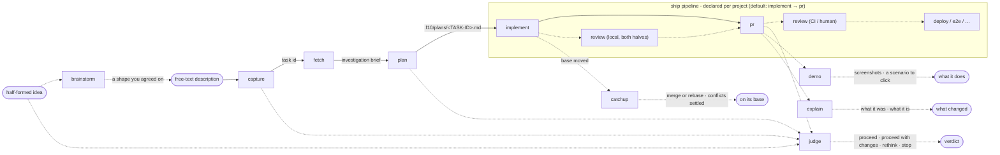
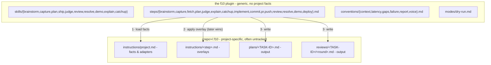
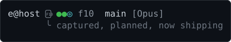

<p align="center">
  
</p>

<div align="center">

### Capture. Plan. Ship.

A language-agnostic, composable task pipeline for Claude Code: **capture → plan → ship**.

[](https://code.claude.com/docs/en/plugins)
[](LICENSE)

</div>

---

f10 (f-ten) is a set of skills over one step chain. Three of them carry it: **capture** turns a
freely written idea into a tracked task, **plan** turns that task into an architect-grade plan on
disk, and **ship** turns the plan into code and, optionally, a release. The rest are optional and
sit around that chain rather than in it - **brainstorm** ahead of it, **judge** at any point of
it, **review** and **resolve** before the PR, **demo** and **explain** after it, **catchup**
whenever the base moved.

No stack is hard-coded, so the same commands drive a Go service, a Rails app, or a Terraform
repo. f10 either **infers** what it needs (git remote → `gh`/`glab`, build files → verify commands)
or you **declare** it once in `.f10/instructions/` and it stops guessing.

## Pipeline


```mermaid
flowchart LR
    idea(["half-formed idea"]) -.-> brain[brainstorm]
    brain -.->|"a shape you agreed on"| desc
    desc(["free-text description"]) --> capSt[capture]
    capSt -->|task id| fetch[fetch]
    fetch -->|investigation brief| plan[plan]
    plan -->|".f10/plans/&lt;TASK-ID&gt;.md"| implement
    subgraph shippipe ["ship pipeline - declared per project (default: implement → pr)"]
        implement[implement] --> pr[pr]
        implement -.-> revL["review (local, both halves)"] -.-> pr
        pr -.-> revC["review (CI / human)"] -.-> deploy["deploy / e2e / …"]
    end
    idea -.-> judge[judge]
    capSt -.-> judge
    plan -.-> judge
    pr -.-> judge
    judge -.->|"proceed · proceed with changes · rethink · stop"| verdict(["verdict"])
    pr -.-> demo[demo]
    demo -.->|"screenshots · a scenario to click"| evidence(["what it does"])
    pr -.-> expl[explain]
    expl -.->|"what it was · what it is"| told(["what changed"])
    implement -.->|"base moved"| catch[catchup]
    catch -.->|"merge or rebase · conflicts settled"| uptodate(["on its base"])
```

Solid arrows are the default pipeline; dashed ones are optional - `brainstorm`, `judge`,
`demo`, `explain` and `catchup` when you ask for them, the rest where a project declares them. Each skill
is an **entry point** into that chain:

| Skill | Runs | Stops at |
|---|---|---|
| `/f10:brainstorm <idea>` | brainstorm | a shape agreed in chat - or the decision not to build |
| `/f10:judge <idea \| id \| PR \| commit> [--blind]` | judge | a verdict in chat: proceed, proceed with changes, rethink, or stop |
| `/f10:capture <desc>` | capture | task created (id + url) |
| `/f10:plan <id \| desc>` | (capture →) fetch → plan | plan file saved, before any code - or, when another worktree's agent has the task, the command handed to it |
| `/f10:ship <id \| plan.md \| desc>` | whatever's missing → the ship pipeline | end of the declared pipeline (an open PR by default) - or the command handed to the task's own agent |
| `/f10:review <id \| PR \| this branch> [ci]` | review | a findings file on disk, written by a reviewer that never saw your session - or read in from the CI review on the PR |
| `/f10:resolve <id \| PR \| this branch>` | resolve | a verdict per finding - fix, skip or ask - fixes verified, every ask in one questionnaire |
| `/f10:demo <PR \| id \| this branch> [--hands-on]` | demo | evidence of what the change does - screenshots and a local report, or a scenario you walk |
| `/f10:explain <PR \| id \| this branch \| local \| concept \| path>` | explain | a change: what it was and what it is now; a thing: what it is, in a few sentences |
| `/f10:catchup` | catchup | the branch on its base - merged or rebased as the project declares - conflicts settled with both sides kept, verify green, nothing pushed |
| `/f10:status [id]` | nothing - a hook answers it; with an id, `f10 status <id>` | the run's status in words, before any model turn; with an id, a task's run in its own worktree, and the question its agent is waiting on relayed to you and answered back |
| `/f10:start <id> [--plan \| --local] [--after <id> \| --base <branch>]` | nothing - it runs `f10 start` | a new worktree, a Herdr workspace and a prompted agent; this session stays where it is |
| `/f10:drive <ids \| id -- id> [skills...]` | nothing - it runs `f10 drive` in the background | every task through its chain - plan, judge, ship, review, resolve, finish by default - each once its base task is finished, independent ones together; an agent's question relayed to you and answered back |
| `/f10:finish <id> [--yes]` | nothing - it runs `f10 finish` | the PR merged, the plan archived, the workspace closed, the worktree and branch gone, main pulled |

## Install

```
/plugin marketplace add amberpixels/f10
/plugin install f10@amberpixels
```

Per-repo setup is optional, and f10 works either way. With no `.f10/` present, steps infer what
they can from the git remote and the repo's build files, so you can install and run immediately.
When you would rather have a fact pinned than guessed - the tracker, the verify commands, the PR
flow - declare it in `.f10/instructions/project.md` and f10 stops inferring that one. Declare as
much or as little as you like; anything you leave out stays inferred.

## Quick start

```text
/f10:brainstorm public API abuse - rate limiting, or per-tenant quotas?
# → a discussion. Nothing written; ends in a shape, or in "we don't build this"

/f10:capture Add rate limiting to the public API
# → creates the tracker task, replies with its id + url

/f10:plan ABC-1042
# → investigates the code, writes .f10/plans/ABC-1042.md, stops before any code

/f10:ship ABC-1042
# → reuses the saved plan (asks first), then runs the ship pipeline

/f10:ship fix the flaky retry test
# → or skip the ceremony: capture-plan-ship a small chore in one go

/f10:review
# → a reviewer that never saw this session reads the branch's diff, writes .f10/reviews/ABC-1042/1.md

/f10:resolve
# → fix, skip or ask per finding; fixes verified; every ask in one questionnaire at the end

/f10:explain
# → what this branch was and what it is now, in a few lines. Nothing run, nothing written

/f10:explain grace period
# → what a grace period is, the way a peer who wrote it would tell you: three or four sentences from the code

/f10:demo
# → before you merge: runs the branch, captures what it does, writes a local report.html

/f10:demo --hands-on
# → same setup, but you drive: a live url and a short scenario to click through
```

`--dry-run` on any skill loads context, settles routing, adapters, and output paths, reports them, and
executes nothing.

## Concepts

**Pipeline**

- **Brainstorm** - the optional conversation before capture: what to build, whether to build it,
  which shape. Read-only and artifact-free by design, it ends in a decision you hand to
  `/f10:capture` or in not building at all. It draws no status-line glyph - there is nothing to
  track yet.
- **Judge** - the optional verdict at any point of the chain: a raw idea, a captured task, a
  saved plan, a PR, or a commit range. It restates the problem, finds it in the code, asks symptom
  or cause, looks for what already exists and for the longer-lived shape, then answers in one word -
  proceed, proceed with changes, rethink, or stop - with the argument under it. `--blind` runs
  it in a fresh agent that sees the subject and the repo, never the conversation that produced
  them. A project may also name `judge` inside its ship pipeline: proceed continues, stop ends
  the run blocked, and rethink or proceed with changes open a discussion that ends in the
  user's call to continue or block. Creates nothing.
- **Review** - the bug hunt, in two halves that never guess each other. `review` hands the full
  diff against base to a **blind** reviewer, a fresh agent that never saw the session which
  wrote the code, with a generic brief: four core categories (correctness and logic,
  architecture and guidelines, security and performance, tests and docs), at most three
  findings each, style skipped unless it affects correctness, "none found" said per category.
  A project adds categories under `project.md → Review`, each pointing at a source-of-truth
  file read as reference data, plus what never to flag. The reviewer writes a **findings file**
  and stops. `resolve` reads that file and records a verdict per finding - `fix`, `skip` or
  `ask`, with `+note` for a comment in the code and `+reply` for a word back to the reviewer -
  re-runs verify after fixes, and puts every `ask` to you in one questionnaire at the end. The
  user's stated choice beats the reviewer: a finding that would undo what the task asked for is
  a skip citing the ask. A second round knows the first: it reports a status per prior finding
  (fixed, still open, the fix introduced a problem, explanation accepted or disputed) before
  anything new, and there is no third - what is still open goes to you. A `review` entry in a
  ship pipeline runs both halves.
- **Demo** - the optional answer to *what was built*, for the moment before you merge a PR whose
  code you did not write. It **says what changed** in plain words - what the app did before, what
  it does now - and derives a **demo script** that confirms it: entry point, the state it needs,
  the steps, what to look for. Then it either runs that script and captures evidence (screenshots
  and a local `report.html`) or seeds the state, leaves the app running and hands you the script
  (`--hands-on`). The executor is declared, never guessed, and a project without a `demo` overlay
  is offered one: the step finds the e2e config, dev-server recipe, seed task and test user the
  project already has, puts them in a single pre-filled questionnaire, writes
  `.f10/instructions/demo.md`, and carries on. That questionnaire also settles where the report
  goes - a local file, a private published page, or both (`--publish` / `--local` per run).
  Evidence is budgeted by claim, not by count, before/after is captured only where something
  visible already existed, and the report carries rows only for artifacts that were actually
  written. Finds no bugs and reaches no verdict - that is `review` and `judge`.
- **Explain** - the optional answer to *what is this*, for a reader who knows the product and
  the codebase but has not met this one thing. For a diff you did not watch happen - an agent's
  branch, a colleague's, your own after a long run - it states each change as a **pair**, what it
  was and what it is now, and cuts every sentence that would still be true if the diff did not
  exist. Two to five items. For a concept, a file, a package or a function, it gives the hallway
  answer a senior dev gives a peer: what it is, what the name hides, where to look, in three or
  four sentences from the code. Nothing run, nothing written either way. Where `demo` shows, `explain` tells:
  it costs a read of the diff instead of a seeded app, which is what makes it the thing you run
  before deciding whether a change is worth demoing at all. Creates nothing.
- **Catchup** - the one verb for a branch that fell behind its base: the branch `f10 start
  --after` recorded, else the default branch. By merge or by rebase, as `project.md` declares
  (`catchup: merge | rebase` under Hosting & PR; rebase when it says nothing), so a merge-flow
  project and a rebase-flow project run the same command. Conflicts are settled by keeping both
  sides' intent - the incoming change and the branch's own - with lock files regenerated from
  their source and only the genuinely ambiguous files put to you, in one questionnaire. Verify
  runs after, and a red verify on a clean integration is a semantic conflict settled the same
  way. A catchup with nothing to settle is a correct run, not a no-op. It is where ship's
  pre-implement integration hands off when it hits a conflict. Nothing is pushed.
- **Step** - the unit of work: `brainstorm`, `capture`, `fetch`, `plan`, `judge`, `explain`,
  `catchup`, plus ship-pipeline steps `implement`, `commit`, `pr`, `push`, `review`, `resolve`,
  `demo`, `deploy` (`steps/*.md`). Skills are thin routers over steps.
- **Ship pipeline** - what `/f10:ship` runs after planning, declared in `project.md` (default
  `implement → pr`). A name with no generic step (e.g. `e2e`) is project-defined:
  `.f10/instructions/<name>.md` *is* the step. A project may declare several **named pipelines**;
  the user picks non-default ones, never the agent. A *(planless)* one skips ticket and plan file.
- **Convention** - a cross-cutting rule every step obeys, in `conventions/`: `context.md` (config
  loading, pipelines, stealth), `latency.md` (turns, not commands), `gaps.md` (open decisions),
  `failure.md` (a step that cannot complete), `report.md` (what a success prints), `voice.md` (how
  it talks). They load as one fixed bundle, once per context, unlike the project bundle, which
  reruns every run.
- **Mode** - an alternate run in `modes/` that replaces execution rather than adding a rule.
  `dry-run.md` is the only one, loaded when `--dry-run` fires.

**Artifacts**

- **Task** - the tracker item. Its **task id** threads through every step and names every artifact.
- **Stage** - one ordered unit inside a plan file. Not a step (a pipeline unit), not a skill (an
  entry point).
- **Plan file** - `<storage root>/plans/<TASK-ID>.md`, the handoff contract between plan and ship.
  The storage root is anchored to the checkout root, so the launch directory does not matter. A
  plan that exists only in chat is a failed run; superseded plans are archived, never edited.
- **Findings file** - `<storage root>/reviews/<TASK-ID>/<round>.md`, the contract between review
  and resolve: the reviewed sha, then one block per finding with title, summary, file and line,
  category, and a concrete fix. Resolve appends its verdict under each block and never edits the
  reviewer's text, so a second round reads both sides. One file per round, two rounds at most.
  The rounds live with the checkout's `.f10/`; `f10 finish` archives the plan, not them.
- **Gap** - an open decision only the user can make. Recorded, not blocking: every gap carries a
  default, so a plan is always shippable. Filling them is an optional batched questionnaire.
- **Shipment** - what a ship run leaves behind, named by the pipeline's last step: verified code
  in the working tree (`implement`), local commits (`commit`), commits pushed to a branch
  (`push`), an open PR/MR (`pr`), a running environment (`deploy`). A PR is one shipment, not
  the word for all of them - a project with no git in its pipeline still ships.

**Project binding**

- **Project instructions** - `<checkout root>/.f10/instructions/`: `project.md` (the facts) plus
  optional per-step **overlays** that extend a generic step. A linked worktree's instructions layer
  on top of main's unless they declare `Layering - replaces main`.
- **Role** - who the agent is for a step. A base role per step, plus **conditional** roles a
  project attaches by area (`+ senior UI/UX engineer` when the task touches user-facing UI). Fetch
  settles the areas, from the task's note or from the code; the plan file records them so ship
  inherits them.
- **Adapter** - how a generic capability ("fetch a task", "open a PR", "verify") binds per project:
  a skill to invoke, or a plain CLI command. f10 names the capability, the project supplies the
  adapter. That is what keeps it stack-agnostic.
- **Review** - a step, local (pre-PR) or CI/human (post-PR), placed or omitted per pipeline. Its
  absence is meaningful: no review entry means ship stops at the opened PR. A project declares
  nothing to get the blind local reviewer; under `project.md → Review` it may add categories,
  each with a source-of-truth file, a never-flag list, and a human reviewer who answers an `ask`
  on a remote review - a local round's asks always come to you. A remote review is four facts in
  the same section - who posts it, where it arrives, what triggers it, what signals done and
  marks it handled - which `f10 init` infers from a Claude Code review workflow and
  `f10 review pick|wait|ack` acts on; f10 never fires a manual trigger itself.
- **Visibility** - `stealth` (default) or `public`. Stealth ships work that reads as if f10 never
  existed: no pipeline mentions in commits, PRs, tickets, or code comments, `.f10/` untracked via
  `.git/info/exclude`.
- **Storage** - `in-repo` (default: one `.f10/` per checkout, so plans sit beside the branch they
  were written against) or `out-of-tree` (`~/.f10/<project>/` holds instructions *and* plans for
  every worktree, zero f10 files inside the project dir). Out-of-tree declares itself by location:
  the loader finds it when the repo has no `.f10/instructions/`.

## Generic vs. project-specific


```mermaid
flowchart TB
    subgraph plugin ["the f10 plugin - generic, no project facts"]
        skills2["skills/{brainstorm,capture,plan,ship,judge,review,resolve,demo,explain,catchup}"]
        gsteps["steps/{brainstorm,capture,fetch,plan,judge,explain,catchup,implement,commit,pr,push,review,resolve,demo,deploy}.md"]
        conv["conventions/{context,latency,gaps,failure,report,voice}.md"]
        modes2["modes/dry-run.md"]
    end
    subgraph repo ["&lt;repo&gt;/.f10 - project-specific, often untracked"]
        proj["instructions/project.md - facts & adapters"]
        over["instructions/&lt;step&gt;.md - overlays"]
        plans2["plans/&lt;TASK-ID&gt;.md - output"]
        reviews2["reviews/&lt;TASK-ID&gt;/&lt;round&gt;.md - output"]
    end
    gsteps -- "1· load facts" --> proj
    gsteps -- "2· apply overlay (later wins)" --> over
    gsteps -- "3· write" --> plans2
    gsteps -- "3· write" --> reviews2
```

Precedence (full contract in `conventions/context.md`): generic step → `main/project.md` →
`main/<step>.md` → `worktree/project.md` → `worktree/<step>.md` → inferred defaults. Later wins,
scope ahead of specificity. It all arrives in one bundle, generic step files included, so a run
never reads `steps/` by hand. A linked worktree layers on top of main's instructions, takes them
wholesale when it has none of its own, or shuts them out with `Layering - replaces main`. Plans
always land in the current worktree.

## Status line

A run happens where you cannot see it: the plan file lands only at the end, the tracker knows
nothing until capture is done, the rest scrolls past. Three glyphs in Claude Code's
[status line](https://code.claude.com/docs/en/statusline) say where the run is, behind an F10
keycap icon that says whose circles they are:



Done is green, running is bright cyan, and the keycap is the Nerd Font glyph `md-keyboard_f10`
(U+F12B4). This is a drawing, not a screenshot, because that codepoint is private-use: it renders
in a patched terminal font and shows as an empty box everywhere else, GitHub included.

| glyph | phase state |
|---|---|
| `○` | pending - has not run |
| `◎` | running |
| `●` | done |
| `◉` | prior - done before this run (`/f10:ship ABC-1` reusing a saved plan) |
| `◌` | skipped - will not happen this run (a planless pipeline never plans) |
| `󰅚` (U+F015A) | partial - stopped, but work survived (committed but push failed, PR open but CI red) |
| `✗` | failed - the run stopped here with nothing usable |
| `󰜺` (U+F073A) | blocked - a judge verdict ended the run; nothing broke, the user decided |

Six of those are common Unicode. Partial's `󰅚` is `md-close-circle-outline` (U+F015A) and
blocked's `󰜺` is `md-cancel` (U+F073A), both Nerd Font private-use codepoints, so on GitHub and in
any unpatched font their cells above are empty boxes. They draw correctly in a patched terminal
font, and the code spans still carry the real characters if you copy one.

Each state has its own shape and color only reinforces it, because a status line is read at a
glance, often in a daltonized theme where red/green is exactly the pair that collapses. `NO_COLOR`
and `F10_STATE_COLOR=0` drop the color and keep the badge readable.

A run that stopped shows one more word: the step it stopped on, so `◉ ● 󰜺 judge` reads as
"blocked at judge" without leaving the status line. A normal run stays three glyphs wide. The
rest - the task, the reason, what unblocks it - is `f10 status`:

```
task      GH-26
url       https://github.com/amberpixels/f10/issues/26
capture   prior
plan      done
ship      blocked at judge
note      stop: the change patches the symptom, the cause is the retry loop in sync.go
next      move the retry into the client and re-run /f10:ship GH-26
updated   4m ago
```

Three ways in, one implementation. From a plain terminal, `f10 status` lists this repo's live
runs (`--all`, every session on the machine; `--json`, the same for scripts). Inside a session,
`! f10 status` runs it where the session id is already in the environment. And `/f10:status`
is for not having to remember which of those it is: the plugin's own hook answers it from
`f10 status` and ends the turn before a model runs, so it costs no tokens. On a machine without
the binary, `f10-state.sh show` prints the same facts for the current session.

A task id names another run: `f10 status 1042` reads the run reported from the checkout that has
the task's branch, the worktree `f10 start` opened. An agent prompted there runs **driven**
([modes/driven.md](modes/driven.md)): it never opens a question in its own pane, where nobody is
looking, but writes the whole questionnaire to run state as one `ask` row and stops blocked.
`/f10:status 1042` prints that row, puts the same questions to you, and sends the answers back as
the agent's next prompt through `f10 forward`.

<details>
<summary>Why circles-by-fill, and the three Nerd Font exceptions</summary>

A codepoint your terminal font lacks does not fail. It is quietly substituted from another font
whose baseline is its own, and the badge renders visibly off the line. `◐`, the obvious mark for
"half done", is missing from JetBrains Mono, Fira Code and Hack alike, so it is not used. If a
glyph still lands wrong in your font, `F10_STATE_GLYPHS` replaces the set.

Three glyphs are deliberate exceptions, all Material Design icons only
[Nerd Fonts](https://www.nerdfonts.com) carry: the label `md-keyboard_f10` (U+F12B4), a whole F10
keycap in a single cell, partial's `md-close-circle-outline` (U+F015A), because no
crossed-circle codepoint exists across those same common fonts (`⊗` is absent from Fira Code),
and blocked's `md-cancel` (U+F073A), because the slashed circle `⊘` is missing even from the Nerd
Fonts. All three are a bet that a terminal dense enough to want this badge is already on a
patched font. On anything else each degrades to one substituted or tofu cell, and the circles
beside them still read.

</details>

### Wiring it up

A plugin cannot ship a `statusLine`, since Claude Code applies only `agent` and
`subagentStatusLine` from a plugin's settings, so this one edit to `~/.claude/settings.json` is
yours to make. f10 re-points `~/.claude/f10/statusline` at its current install on every session
start, so the path below keeps working across plugin updates:

```sh
input=$(cat)                                                             # you already do this
f10=$(printf '%s' "$input" | "$HOME/.claude/f10/statusline" 2>/dev/null)  # ← add
printf '%s@%s%s %s' "$user" "$host" "$f10" "$dir"                        # ← drop it in anywhere
```

The segment brings its own leading space and is empty when no run is live, so it concatenates
unconditionally. At a label plus three glyphs it is narrow enough to sit anywhere, even between
`user@host` and the directory, without crowding the branch.

Set `"refreshInterval": 2` on `statusLine` as well: it otherwise re-runs only when an assistant
message arrives, and a long implement step would sit on a stale glyph for minutes.
`f10-state.sh doctor` reports where state lives, whether the symlink is in place, and what the
badge renders right now.

State is one small file per session in `~/.claude/f10/state/`, outside every repo, because stealth
mode wants nothing f10-shaped inside a project directory, not even untracked. `/clear` mints a new
session and so retires the badge; a file older than the TTL stops rendering.

| variable | default | |
|---|---|---|
| `F10_STATE_DIR` | `~/.claude/f10/state` | where state files live |
| `F10_STATE_TTL` | `86400` | seconds before a badge reads as stale |
| `F10_STATE_COLOR` | `1` | `0` (or `NO_COLOR`) for shapes without color |
| `F10_STATE_LINK` | `1` | `0` to drop the hyperlink on the task id |
| `F10_STATE_GLYPHS` | `○ ◎ ● ◌ ✗ ◉ 󰅚 󰜺` | pending, running, done, skipped, failed, prior, partial, blocked |

All eight positions are required when you override `F10_STATE_GLYPHS`; the last two render as
empty boxes here for the reason above, but the code spans hold the real U+F015A and U+F073A.

<details>
<summary>How the badge stays current: two writers</summary>

- **Hooks** (`hooks/hooks.json`) - `UserPromptExpansion` and `PreToolUse` catch a skill starting,
  whether it was typed or the model invoked it, and read the argument to tell a description (which
  routes through capture) from a task id (which does not); the first also answers a bare
  `/f10:status` outright, with a blocking verdict on stdout, which is what ends the turn. `PostToolUse` catches
  the plan file being written, which is both "plan done" and where the task id comes from. `Stop`
  closes out whatever is still marked running when the turn ends. `SessionStart` prunes dead state
  and refreshes the symlink.
- **Steps** - one `f10-state.sh set` call as each phase opens and closes. Per
  `conventions/report.md` the badge is **cosmetic and best-effort**: nothing reads it back, and a
  call that fails costs a glyph and nothing else.

The steps report precisely and the hooks report reliably, and the second is why the first is
allowed to be best-effort. An instruction to write one more line *after* the pipeline, the PR and
the report is the one an agent is most likely to drop, so a run that finished would otherwise sit
on a spinning glyph until the TTL retired it. For the same reason a phase left `pending` means
"nobody said", not "it did not happen", which is why the route is read from the argument at the
start rather than inferred from silence at the end.

</details>

Unrelated to f10 but pairs with it:
[`footerLinksRegexes`](https://code.claude.com/docs/en/settings#footer-link-badges) turns a task id
appearing in a reply into a clickable footer badge - one regex per tracker, no script at all.

## The binary

`f10 config`, run inside a repo, prints the effective f10 configuration with a provenance per
value - `detected`, `declared (main)`, `declared (worktree)`, `default`, `absent` - like
`git config --show-origin` with detection as a first-class origin. `--json` emits the same view
for scripting.

```bash
just install   # go install ./cli/cmd/f10
f10 --version  # the release number from `go install ...@vX.Y.Z`, the commit from a checkout build
f10 config
```

`f10 init` is where that configuration comes from. Run inside a checkout that declares none, it
writes `.f10/instructions/project.md` from what the probes found - stack, tracker and its id
format, host and PR CLI, verify commands, storage and visibility - and adds the stealth `.f10/`
line to `.git/info/exclude`. Sections nothing detected are left out rather than stubbed, since
`absent` already carries a default; the `Project` one-liner is left to you, because no probe
reaches what a project *is*. It creates and never overwrites, and the file's existence is what
marks the directory as an f10 project.

### Lookaround

The same binary reads the things that configuration points at. Which tool it reaches for is a
function of the repo, not of your memory: `gh` here, `glab` there, your own driver where the
tracker has no CLI at all.

```bash
f10 task read            # the current task as markdown - from the branch, or this session
f10 task open 1042       # in the browser
f10 task search billing  # rows, not a picker
f10 plan read            # the plan saved for that same task
f10 demo open            # the demo report for it, in the browser
f10 pr open              # this branch's PR or MR, gh or glab decided by the remote
f10 review pick|wait|ack # the remote review on that PR: read it, await it, mark it handled
f10 status               # where the run is: this session's, or this repo's live ones
f10 status 1042          # a task's run in its own worktree, the question its agent waits on included
```

A reference is an id in any of its shapes - `1042`, `#1042`, `ABC-1042` - or the task's url
pasted from the browser.

A verb means one thing under every noun. `read` writes content, `open` follows an address,
`search` finds by description; `--print` writes the address instead of following it. The matrix
stays sparse where a verb has no meaning for a noun, and never redefines one to fill a hole.

With no argument, a reference is looked up in one cascade: the id you passed, else the id in the
current branch name, else the task this session recorded. `-C` answers for another checkout, so
chasing a library's task from inside the app that hit the bug costs no `cd`:

```bash
f10 -C ../r3 task read 12                    # a path always works
export F10_ROOTS=~/code/github.com/*/*       # opt in, and names work too
f10 -C r3 task read 12
```

`read` writes markdown and picks its presentation from whether it is writing to a terminal: a
pager when `$PAGER` is set, raw markdown into any pipe. Nothing is bundled and nothing is
required, so `f10 task read | glow` works precisely because a pipe is not a terminal.

Where the tracker is Notion, Jira or anything else without a CLI, `f10 task` routes through an
executable at `.f10/driver` - see [the driver contract](docs/driver-contract.md). f10 specifies
that contract and implements none of it.

### Start

Starting a task used to be three hand-offs across three tools: a justfile recipe creating the
worktree, a Herdr dialog turning it into a tab, a shell function launching claude there with a
prompt typed by hand. Each hand-off was a place to lose the branch suffix, the base branch or the
"keep it local" words. `f10 start` is the one command:

```bash
f10 start 1042                # branch, worktree, Herdr workspace, claude prompted with plan + ship
f10 start 1042 --plan         # prompt the plan only
f10 start 1042 --local        # ship through the project's `local` pipeline: commits, nothing pushed
f10 start 1042 --after 1040   # base the branch on that task's branch, record the dependency, stack the PR
                              # (no flag: the task body's `After:` line, when it has one)
f10 start 1042 --base rel/2   # base the branch on a git ref: the local branch, else origin's
f10 start 1042-attempt2       # a second worktree for the same task, beside the first
```

The branch name is the driver's `branch` verb where the project has one, else `<ID>/<slug>` with
the slug cut from the task's title, so a Herdr tab says what the task is.
The worktree goes through [worktrunk](https://github.com/max-sixty/worktrunk) when `wt` is on
`PATH`, so the project's hooks keep firing, and through plain git at the same sibling path when it
is not. The command returns once the prompt is submitted and never waits on the agent, so a
session inside Herdr can run it too - `/f10:start` is that skill. It runs inside a Herdr session
only; outside one it stops before touching anything and points at https://herdr.dev. Run twice
for one task it opens the worktree that exists and leaves the agent already in it alone, rather
than failing. The prompt ends in `--driven`: the agent asks nothing in a pane nobody watches,
and routes every question through run state instead ([modes/driven.md](modes/driven.md)).

### Forward

A task started that way lives in three places - its worktree, its workspace, its agent - and a
`/f10:ship 1042` typed in the main session knows none of them: it would ship on `main`, without
the plan, which sits in the worktree's own `.f10/`. `f10 forward` is the hand-off the plan and
ship skills make first:

```bash
f10 forward 1042 "/f10:ship 1042"      # the command goes to 1042's agent, marked --driven
f10 forward 1042 "1. reuse 2. proceed"  # an answer to the question that agent stopped on
```

It resolves the task to its branch, the branch to its worktree, the worktree to the workspace
showing it and the workspace to the agent start named, and submits the text as that agent's next
prompt. It returns at submission and prints three rows - task, workspace, sent - since the
outcome lands in that tab; this session's badge does not move. A task whose branch is checked
out right here, or nowhere, exits 3 with the reason, and the skill runs the command locally as
before. An agent Herdr reports idle while its run still says running is waiting on something f10
cannot see, a Claude Code permission dialog in its pane: forward names the workspace and sends
nothing. Judge, demo and explain are never forwarded, since they read another worktree's branch
fine and write nothing.

### Drive

One command still moves one task one step. `f10 drive` moves a list, from the main session:

```bash
f10 drive 1042 1043                  # each task through project.md's Drive chain, bases first
f10 drive 1042 -- 1047 judge ship    # every id from 1042 to 1047, through judge and ship only
f10 drive 1042 1043 --answer "1. proceed"   # the same command, answering the question it stopped on
```

Each task waits for its one base, and every task whose base is finished runs at once. Per task
it opens the worktree, workspace and agent as `f10 start` does, then prompts the agent one skill at
a time and polls until the turn ends: Herdr's agent status says when the turn starts and
stops, the task's run state says how it ended. `finish` runs in the driver itself. The chain is
`plan → judge → ship → review → resolve → finish` unless `project.md` declares a **Drive chain** or
the command names one; review after ship reads the remote review where one is declared. The run
pauses only when an agent asks: the driver prints the question and exits 4, and `/f10:drive` puts it
to you and reruns the command with the answer, one per asking task. A judge stop or a failure halts
that task and the ones waiting on it, while the rest run on, and exits 5. A started task whose base
`finish` just merged is caught up with main by `/f10:catchup` before its next skill. Rerunning the same
command is the resume: a finished task is skipped, and a started one carries on from the last skill
the driver recorded on its branch.

A task that builds on another says so in its body: a last line `After: 1042`. Capture writes it,
`f10 start` takes it as the default `--after`, and `f10 drive` runs the base first wherever it is
listed. It refuses a dependency on a task outside the list that is not finished, and tasks that
wait on each other in a circle.

### Finish

Closing a task is the same three tools in reverse, and the two steps people skip - the worktree
and the pull - leave a graveyard of sibling directories and a main behind the PR it just merged.
`f10 finish` is start's inverse:

```bash
f10 finish 1042          # merge the PR, pull main, archive the plan, close the workspace, remove the worktree and branch
f10 finish 1042 --yes    # the same from inside the task's own workspace, which closes after the report
```

It merges through `gh pr merge` or `glab mr merge` when the PR is open, or confirms it is already
merged, and stops with the host's own reason when the host refuses: red CI, a required review, a
conflict. It never passes `--admin`. Everything after is gated on the merge having landed in the
local default branch, and the plan is out of the worktree before the worktree goes. Branches
started with `--after` on the finished one lose their dependency, since its code is in main now.
Refusals come before anything changes: a dirty worktree, named file by file, with no `--force`;
a PR stacked on another task's branch, which waits for that task; a cwd inside the worktree
being removed, unless `--yes` was passed. `/f10:finish` is the skill that turns that last
refusal into one question.

### Lookaround by design

No uniform storage (everything stays in the files where it lives today; the binary reads and
pre-computes), no scanning (it answers for the repo it runs in, and walks the filesystem for
other projects only once you set `F10_ROOTS`), and four writing verbs: `init` creates the two
files that register a project, `start` creates a branch and a worktree, `drive` does what start
does for each task in a list and records each task's last finished skill in local git config,
`finish` removes them once the work merged, and nothing else writes anywhere - handing a url to a browser or a file to an editor is the whole of what leaves the
process otherwise. `bin/bundle.sh` stays the agent-facing surface - the binary explains to
humans what the loader hands to agents, and it is the one component allowed to interpret `project.md` prose. What it cannot
place it shows as-is under an `unrecognized` marker rather than guessing: incomplete, never
wrong. The parity suite in `cli/internal/layout` runs every fixture through both the Go
layout and the script, so their semantics cannot drift apart silently.

## Development

f10's executable surface is `bin/` plus `cli/`. In `bin/`: `conventions.sh` cats the six
convention files, `bundle.sh` loads one repo's instructions, `f10-state.sh` records where a
run is for the status line to draw. The first two split on static vs. loaded: one is identical
everywhere and loads once per context, the other varies by repo and worktree and reruns every
run. The third is on neither side, because it writes and nothing in the pipeline reads it back.
`cli/` is the read-only lookaround binary above, a Go module of its own
(`github.com/amberpixels/f10/cli`) with `cmd/f10` as its main. The repo root is the plugin;
the binary lives beside it, in one repo because its parity tests run the scripts in `bin/`.

```bash
just lint   # shell + Go findings, change nothing (with `just test`, what CI runs)
just fmt    # rewrite shell + Go to canonical form
just fix    # apply everything auto-fixable - run on a clean tree, read the diff
just test   # go test ./..., the bundle.sh parity suite included
just build  # go build ./...
```

Each root recipe covers both halves: the shell half in place, the Go half through the `cli`
module, so `just cli::test` runs Go alone. Shell is
[shellcheck](https://www.shellcheck.net) for correctness and
[shfmt](https://github.com/mvdan/sh) for formatting - scripts are discovered by `shfmt -f`,
which matches on extension *and* shebang, so a new `bin/whatever` is covered the moment it
exists, and enabled shellcheck optionals are documented in `.shellcheckrc`. Go is
[standardgo](https://github.com/amberpixels/standardgo), pinned by version in `cli/justfile` -
the ruleset ships in the binary, so there is no lint config file to drift. The
justfile started from [justx](https://github.com/amberpixels/just-x); its fences were removed
when the repo went hybrid, so every recipe is hand-owned now.

## Status

Skills over one step file per unit of work: `brainstorm`, `capture`, `plan`, `ship`, `judge`,
`review`, `resolve`, `demo`, `explain` and `catchup`. Project facts come from `.f10/instructions/` through the loader,
worktree-layered, with inferred defaults where nothing is declared. Six conventions bind every
run: what it costs, how it fails, how it reports, how it talks, where open decisions go, and how
context loads. A status-line badge tracks the run through capture, plan and ship, `f10 status`
says in words where it is and why it stopped, and the `f10` binary explains the loaded
configuration, writes the `project.md` that registers a checkout, and reads tasks, plans and PRs
through `gh`, `glab`, or a project's own driver.

Next: the `/f10:init` skill over that command (the `Project` line and guardrails read out of a
repo, not detected) + shared **profiles**, named configs a repo's `project.md` references
instead of repeating.

## Docs

- [Setting up a project](docs/project-setup.md): `f10 init`, `project.md`, overlays, pipelines, storage, worktrees.
- [The status line](docs/statusline.md): wiring the badge and reading it.
- [The `f10` binary](docs/cli.md): every command, references, output.
- [The driver contract](docs/driver-contract.md): a tracker without a CLI.

## Feedback

A solo, opinionated project, but ideas, questions, and bug reports are always welcome as an
[issue](https://github.com/amberpixels/f10/issues) :)

## License

[MIT](LICENSE) © [amberpixels](https://amberpixels.io)
