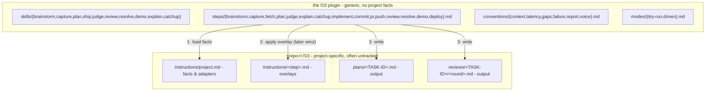

<p align="center">
  
</p>

<div align="center">

### Capture. Plan. Ship.

A language-agnostic, composable task pipeline for Claude Code.

[](https://code.claude.com/docs/en/plugins)
[](LICENSE)

</div>

---

f10 (f-ten) is a set of skills over one step chain. **capture** turns a freely written idea into
a tracked task, **plan** turns the task into an architect-grade plan on disk, and **ship** turns
the plan into code and, optionally, a release. The rest are optional: **brainstorm** before the
chain, **judge** at any point, **review** and **resolve** before the PR, **demo** and **explain**
after it, **catchup** whenever the base moved.

No stack is hard-coded: the same commands drive a Go service, a Rails app, or a Terraform repo.
f10 **infers** what it needs (the git remote gives `gh`/`glab`, build files give verify
commands), or you **declare** it once in `.f10/instructions/`.

## Pipeline


```mermaid
flowchart LR
    idea(["half-formed idea"]) -.-> brain[brainstorm]
    brain -.->|"a shape you agreed on"| desc
    desc(["free-text description"]) --> capSt[capture]
    capSt -->|task id| fetch[fetch]
    fetch -->|investigation brief| plan[plan]
    plan -->|".f10/plans/&lt;TASK-ID&gt;.md"| implement
    subgraph shippipe ["ship pipeline - declared per project (default: implement → pr)"]
        implement[implement] --> pr[pr]
        implement -.-> revL["review (local, both halves)"] -.-> pr
        pr -.-> revC["review (CI / human)"] -.-> deploy["deploy / e2e / …"]
    end
    idea -.-> judge[judge]
    capSt -.-> judge
    plan -.-> judge
    pr -.-> judge
    judge -.->|"proceed · proceed with changes · rethink · stop"| verdict(["verdict"])
    pr -.-> demo[demo]
    demo -.->|"screenshots · a scenario to click"| evidence(["what it does"])
    pr -.-> expl[explain]
    expl -.->|"what it was · what it is"| told(["what changed"])
    implement -.->|"base moved"| catch[catchup]
    catch -.->|"merge or rebase · conflicts settled"| uptodate(["on its base"])
```

Solid arrows are the default pipeline. Dashed ones are optional: `brainstorm`, `judge`, `demo`,
`explain` and `catchup` when you ask, the rest where a project declares them. Each skill is an
**entry point** into the chain:

| Skill | Runs | Stops at |
|---|---|---|
| `/f10:brainstorm <idea>` | brainstorm | a shape agreed in chat, or the decision not to build |
| `/f10:judge <idea \| id \| PR \| commit> [--blind]` | judge | a verdict: proceed, proceed with changes, rethink, or stop |
| `/f10:capture <desc>` | capture | task created (id + url) |
| `/f10:plan <id \| desc>` | (capture,) fetch, plan | plan file saved, before any code; or handed to the task's own agent |
| `/f10:ship <id \| plan.md \| desc>` | whatever's missing, then the ship pipeline | end of the declared pipeline (an open PR by default); or handed to the task's own agent |
| `/f10:review <id \| PR \| this branch> [ci]` | review | a findings file from a reviewer that never saw your session, or read in from the CI review |
| `/f10:resolve <id \| PR \| this branch>` | resolve | fix, skip or ask per finding, fixes verified, asks in one questionnaire |
| `/f10:demo <PR \| id \| this branch> [--hands-on]` | demo | screenshots and a local report, or a scenario you walk |
| `/f10:explain <PR \| id \| this branch \| local \| concept \| path>` | explain | a change: what it was and is now; a thing: what it is |
| `/f10:catchup` | catchup | the branch merged or rebased onto its base, conflicts settled, verify green, nothing pushed |
| `/f10:status [id]` | nothing: a hook answers it; with an id, `f10 status <id>` | the run's status in words; with an id, another worktree's run and its agent's question, relayed and answered |
| `/f10:start <id> [--plan \| --local \| --discuss] [--after <id> \| --base <branch>]` | nothing: it runs `f10 start` | a new worktree, Herdr workspace and prompted agent |
| `/f10:drive <ids \| id -- id> [skills...]` | nothing: it runs `f10 drive` in the background | every task through its chain (plan, judge, ship, review, resolve, finish by default), bases first; agents' questions relayed |
| `/f10:finish <id> [--yes]` | nothing: it runs `f10 finish` | PR merged, plan archived, workspace closed, worktree and branch gone, main pulled |

## Install

```
/plugin marketplace add amberpixels/f10
/plugin install f10@amberpixels
```

Per-repo setup is optional. With no `.f10/`, steps infer what they can from the git remote and
build files, so you can run immediately. To pin a fact instead (the tracker, the verify commands,
the PR flow), declare it in `.f10/instructions/project.md`; anything you leave out stays inferred.

## Quick start

```text
/f10:brainstorm public API abuse - rate limiting, or per-tenant quotas?
# → a discussion. Nothing written; ends in a shape, or in "we don't build this"

/f10:capture Add rate limiting to the public API
# → creates the tracker task, replies with its id + url

/f10:plan ABC-1042
# → investigates the code, writes .f10/plans/ABC-1042.md, stops before any code

/f10:ship ABC-1042
# → reuses the saved plan (asks first), then runs the ship pipeline

/f10:ship fix the flaky retry test
# → or skip the ceremony: capture-plan-ship a small chore in one go

/f10:review
# → a reviewer that never saw this session reads the branch's diff, writes .f10/reviews/ABC-1042/1.md

/f10:resolve
# → fix, skip or ask per finding; fixes verified; every ask in one questionnaire at the end

/f10:explain
# → what this branch was and what it is now, in a few lines. Nothing run, nothing written

/f10:explain grace period
# → what a grace period is, the way a peer who wrote it would tell you: three or four sentences from the code

/f10:demo
# → before you merge: runs the branch, captures what it does, writes a local report.html

/f10:demo --hands-on
# → same setup, but you drive: a live url and a short scenario to click through
```

`--dry-run` on any skill reports the loaded context, routing, adapters and output paths, and
executes nothing.

## Concepts

**Pipeline**

- **Brainstorm** - the optional conversation before capture: what to build, whether to, which
  shape. It writes nothing and draws no badge glyph, and ends in a shape you hand to
  `/f10:capture`, or in not building.
- **Judge** - a verdict on an idea, task, plan, PR or commit range: real problem or stated one,
  symptom or cause, what already exists, a longer-lived shape. `--blind` runs it in a fresh
  agent that never saw the conversation. In a ship pipeline, proceed continues, stop ends the
  run blocked, and the other two open a discussion ending in your call. Creates nothing.
- **Review** - the bug hunt, in two halves. `review` gives the full diff to a **blind**
  reviewer (the default, with nothing declared): four core categories (correctness and logic,
  architecture and guidelines, security and performance, tests and docs), at most three findings
  each, style skipped unless it affects correctness, written to a **findings file**. A project
  adds categories under `project.md → Review`, each with a source-of-truth file, plus what never
  to flag. `resolve` gives each finding `fix`, `skip` or `ask` (`+note` for a code comment,
  `+reply` to answer the reviewer), re-verifies, and puts every `ask` to you in one
  questionnaire. Your stated choice beats the reviewer. A second round reports on every prior
  finding first; there is no third, and what is still open goes to you. A `review` entry in a
  ship pipeline runs both halves.
- **Demo** - *what was built*, before you merge code you did not write: what changed in plain
  words, then a **demo script** it runs for screenshots and a local `report.html`, or
  (`--hands-on`) seeds the state and hands you the running app. The executor is declared, never
  guessed: a project without a `demo` overlay gets one proposed from its e2e config, dev-server
  recipe, seed task and test user, written to `.f10/instructions/demo.md`, along with where
  reports go: a local file, a private published page, or both (`--publish` / `--local` per run).
  One shot per claim, before/after only where something visible already existed, report rows
  only for artifacts written. No bug hunt, no verdict.
- **Explain** - *what is this*, for a reader who knows the codebase. A change becomes two to five
  **pairs**, what it was and what it is now; a concept, file, package or function gets three or
  four sentences from the code. Cheaper than a demo, so run it first.
- **Catchup** - brings a branch up to its base (the branch `f10 start --after` recorded, else the
  default branch), by merge or rebase (`catchup: merge | rebase` under Hosting & PR; rebase by
  default), keeping both sides' intent: lock files regenerated, only truly ambiguous files put to
  you in one questionnaire. Red verify after a clean integration is a semantic conflict, settled
  the same way. Nothing to settle is a correct run. Ship hands off here on a conflict. Nothing is
  pushed.
- **Step** - the unit of work in `steps/*.md`. Skills are thin routers over steps.
- **Ship pipeline** - what `/f10:ship` runs after planning, declared in `project.md` (default
  `implement → pr`). A name with no generic step (e.g. `e2e`) is project-defined:
  `.f10/instructions/<name>.md` *is* the step. Of several **named pipelines**, only the user
  picks a non-default one. A *(planless)* one skips ticket and plan file.
- **Convention** - a rule every step obeys, in `conventions/`: `context.md` (config loading,
  pipelines, stealth), `latency.md` (turns, not commands), `gaps.md` (open decisions),
  `failure.md` (a step that cannot complete), `report.md` (what a success prints), `voice.md`
  (how it talks). They load once per context; the project bundle reloads every run.
- **Mode** - a run in `modes/` that changes execution: `dry-run.md` (`--dry-run`) and
  `driven.md` (`--driven`, a run prompted from another session).

**Artifacts**

- **Task** - the tracker item. Its **task id** names every artifact downstream.
- **Stage** - one ordered unit inside a plan file. Not a step, not a skill.
- **Plan file** - `<storage root>/plans/<TASK-ID>.md`, the handoff from plan to ship. The storage
  root is anchored to the checkout root, whatever the launch directory. A plan only in chat is a
  failed run; superseded plans are archived, never edited.
- **Findings file** - `<storage root>/reviews/<TASK-ID>/<round>.md`, from review to resolve: the
  reviewed sha, then one block per finding (title, summary, file and line, category, a concrete
  fix). Resolve appends verdicts and never edits the reviewer's text. Two rounds at most; they
  stay in the checkout's `.f10/`, since `f10 finish` archives only the plan.
- **Gap** - a decision only the user can make, recorded with a default so the plan is always
  shippable. Filling gaps is one optional questionnaire.
- **Shipment** - what a ship run leaves, named by the pipeline's last step: verified code
  (`implement`), local commits (`commit`), pushed commits (`push`), an open PR/MR (`pr`), a
  running environment (`deploy`). A project with no git in its pipeline still ships.

**Project binding**

- **Project instructions** - `<checkout root>/.f10/instructions/`: `project.md` (the facts) plus
  optional per-step **overlays**. A linked worktree's instructions layer on main's unless they
  declare `Layering - replaces main`.
- **Role** - a base role per step, plus **conditional** roles by area (`+ senior UI/UX engineer`
  when the task touches user-facing UI). Fetch settles the areas; the plan file records the roles
  for ship.
- **Adapter** - how a capability ("fetch a task", "open a PR", "verify") binds per project: a
  skill or a CLI command. f10 names the capability; the project supplies the adapter.
- **Review** - local (pre-PR) or CI/human (post-PR), placed or omitted per pipeline; no review
  entry means ship stops at the PR. A remote review is four facts under `project.md → Review`
  (who posts it, where it arrives, what triggers it, what marks it done and handled), inferred by
  `f10 init` from a Claude Code review workflow and acted on by `f10 review pick|wait|ack`. f10
  never fires a manual trigger. A declared human reviewer answers asks on a remote review; a
  local round's asks come to you.
- **Visibility** - `stealth` (default) or `public`. Stealth work reads as if f10 never existed:
  no mentions in commits, PRs, tickets or code comments, `.f10/` untracked via
  `.git/info/exclude`.
- **Storage** - `in-repo` (default: one `.f10/` per checkout, beside its branch) or `out-of-tree`
  (`~/.f10/<project>/` holds instructions *and* plans for every worktree, nothing inside the
  project dir), found when the repo has no `.f10/instructions/`.

## Generic vs. project-specific


```mermaid
flowchart TB
    subgraph plugin ["the f10 plugin - generic, no project facts"]
        skills2["skills/{brainstorm,capture,plan,ship,judge,review,resolve,demo,explain,catchup}"]
        gsteps["steps/{brainstorm,capture,fetch,plan,judge,explain,catchup,implement,commit,pr,push,review,resolve,demo,deploy}.md"]
        conv["conventions/{context,latency,gaps,failure,report,voice}.md"]
        modes2["modes/{dry-run,driven}.md"]
    end
    subgraph repo ["&lt;repo&gt;/.f10 - project-specific, often untracked"]
        proj["instructions/project.md - facts & adapters"]
        over["instructions/&lt;step&gt;.md - overlays"]
        plans2["plans/&lt;TASK-ID&gt;.md - output"]
        reviews2["reviews/&lt;TASK-ID&gt;/&lt;round&gt;.md - output"]
    end
    gsteps -- "1· load facts" --> proj
    gsteps -- "2· apply overlay (later wins)" --> over
    gsteps -- "3· write" --> plans2
    gsteps -- "3· write" --> reviews2
```

Precedence (full contract in `conventions/context.md`), later winning: the generic step,
`main/project.md`, `main/<step>.md`, `worktree/project.md`, `worktree/<step>.md`, then inferred
defaults. It all arrives in one bundle, generic step files included, so a run never reads
`steps/` by hand. A linked worktree layers on main's instructions, takes them wholesale when it
has none, or shuts them out with `Layering - replaces main`. Plans always land in the current
worktree.

## Status line

Most of a run scrolls past unseen. Three glyphs in Claude Code's
[status line](https://code.claude.com/docs/en/statusline), behind an F10 keycap icon, say where
it is:


Done is green, running is bright cyan, and the keycap is the Nerd Font glyph `md-keyboard_f10`
(U+F12B4). It is a drawing, not a screenshot: that private-use codepoint shows as an empty box
outside a patched terminal font, GitHub included.

| glyph | phase state |
|---|---|
| `○` | pending - has not run |
| `◎` | running |
| `●` | done |
| `◉` | prior - done before this run (`/f10:ship ABC-1` reusing a saved plan) |
| `◌` | skipped - will not happen this run (a planless pipeline never plans) |
| `󰅚` (U+F015A) | partial - stopped, but work survived (committed but push failed, PR open but CI red) |
| `✗` | failed - the run stopped here with nothing usable |
| `󰜺` (U+F073A) | blocked - a judge verdict ended the run; nothing broke, the user decided |

Partial's `󰅚` is `md-close-circle-outline` (U+F015A) and blocked's `󰜺` is `md-cancel`
(U+F073A), Nerd Font private-use codepoints: empty boxes on GitHub, correct in a patched terminal
font, and real characters if you copy the code span.

Each state has its own shape; color only reinforces it, since red and green collapse in a
daltonized theme. `NO_COLOR` and `F10_STATE_COLOR=0` drop the color.

A normal run stays three glyphs wide; a stopped one adds its step: `◉ ● 󰜺 judge` reads as
"blocked at judge". The task,
the reason and what unblocks it are in `f10 status`:

```
task      GH-26
url       https://github.com/amberpixels/f10/issues/26
capture   prior
plan      done
ship      blocked at judge
note      stop: the change patches the symptom, the cause is the retry loop in sync.go
next      move the retry into the client and re-run /f10:ship GH-26
updated   4m ago
```

From a terminal, `f10 status` lists this repo's live runs (`--all` for every session on the
machine, `--json` for scripts). Inside a session, `! f10 status` has the session id already;
`/f10:status` is answered by the plugin's hook before a model runs, so it costs no tokens.
Without the binary, `f10-state.sh show` prints the same for the current session.

`f10 status 1042` reads another run: the one in the worktree that has the task's branch. An
agent there runs **driven** ([modes/driven.md](modes/driven.md)): instead of asking in a pane
nobody watches, it writes its questions to run state as one `ask` row and stops blocked.
`/f10:status 1042` puts them to you and sends the answers back through `f10 forward`.

<details>
<summary>Why circles-by-fill, and the three Nerd Font exceptions</summary>

A codepoint your font lacks is substituted from another font with its own baseline, and the
badge renders off the line. `◐` is missing from JetBrains Mono, Fira Code and Hack, so it is not
used. If a glyph still lands wrong, `F10_STATE_GLYPHS` replaces the set.

Three glyphs are Material Design icons only [Nerd Fonts](https://www.nerdfonts.com) carry: the
label `md-keyboard_f10` (U+F12B4), a whole keycap in one cell; partial's
`md-close-circle-outline` (U+F015A), since no crossed circle exists across those fonts (`⊗` is
absent from Fira Code); and blocked's `md-cancel` (U+F073A), since `⊘` is missing even from the
Nerd Fonts. Elsewhere each degrades to one tofu cell, and the circles still read.

</details>

### Wiring it up

Claude Code applies only `agent` and `subagentStatusLine` from a plugin's settings, so a plugin
cannot ship a `statusLine`; add this to `~/.claude/settings.json` yourself. f10 re-points
`~/.claude/f10/statusline` at its current install every session start, so the path survives
plugin updates:

```sh
input=$(cat)                                                             # you already do this
f10=$(printf '%s' "$input" | "$HOME/.claude/f10/statusline" 2>/dev/null)  # ← add
printf '%s@%s%s %s' "$user" "$host" "$f10" "$dir"                        # ← drop it in anywhere
```

The segment brings its own leading space and is empty when no run is live, so it fits anywhere,
even between `user@host` and the directory.

Set `"refreshInterval": 2` on `statusLine` too; otherwise it refreshes only on assistant
messages, and a long implement step shows a stale glyph. `f10-state.sh doctor` reports where
state lives, whether the symlink is in place, and what the badge renders now.

State is one small file per session in `~/.claude/f10/state/`, outside every repo (stealth wants
nothing f10-shaped in a project). `/clear` starts a new session and retires the badge; a file
older than the TTL stops rendering.

| variable | default | |
|---|---|---|
| `F10_STATE_DIR` | `~/.claude/f10/state` | where state files live |
| `F10_STATE_TTL` | `86400` | seconds before a badge reads as stale |
| `F10_STATE_COLOR` | `1` | `0` (or `NO_COLOR`) for shapes without color |
| `F10_STATE_LINK` | `1` | `0` to drop the hyperlink on the task id |
| `F10_STATE_GLYPHS` | `○ ◎ ● ◌ ✗ ◉ 󰅚 󰜺` | pending, running, done, skipped, failed, prior, partial, blocked |

Overriding `F10_STATE_GLYPHS` takes all eight positions; the last two hold the real U+F015A and
U+F073A.

<details>
<summary>How the badge stays current: two writers</summary>

- **Hooks** (`hooks/hooks.json`) - `UserPromptExpansion` and `PreToolUse` catch a skill
  starting, typed or model-invoked, and read the argument to tell a description (routed through
  capture) from a task id; the first also answers a bare `/f10:status` with a blocking verdict
  on stdout, ending the turn. `PostToolUse` catches the plan file being written: "plan done",
  and the task id. `Stop` closes out whatever is still running. `SessionStart` prunes dead state
  and refreshes the symlink.
- **Steps** - one `f10-state.sh set` call as each phase opens and closes, **cosmetic and
  best-effort** per `conventions/report.md`.

Steps report precisely, hooks reliably: `Stop` closes a run whose last badge line the agent
dropped. A phase left `pending` means "nobody said".

</details>

Unrelated to f10 but pairs with it: Claude Code's
[`footerLinksRegexes`](https://code.claude.com/docs/en/settings#footer-link-badges) turns a task id
in a reply into a clickable footer badge, one regex per tracker, no script.

## The binary

`f10 config` prints a repo's effective configuration with each value's provenance (`detected`,
`declared (main)`, `declared (worktree)`, `default`, `absent`), like `git config --show-origin`.
`--json` for scripts. Full reference: [docs/cli.md](docs/cli.md).

```bash
just install   # go install ./cli/cmd/f10
f10 --version  # the release number from `go install ...@vX.Y.Z`, the commit from a checkout build
f10 config
```

`f10 init` writes `.f10/instructions/project.md` from what the probes found (stack, tracker and
id format, host and PR CLI, verify commands, storage, visibility) and adds the stealth `.f10/`
line to `.git/info/exclude`. Undetected sections are left out, not stubbed, and the `Project`
one-liner is yours to write. It never overwrites; the file's existence marks an f10 project.

### Lookaround

The same binary reads what that configuration points at, with the repo's own tool: `gh` here,
`glab` there, your driver where the tracker has no CLI.

```bash
f10 task read            # the current task as markdown - from the branch, or this session
f10 task open 1042       # in the browser
f10 task search billing  # rows, not a picker
f10 plan read            # the plan saved for that same task
f10 demo open            # the demo report for it, in the browser
f10 pr open              # this branch's PR or MR, gh or glab decided by the remote
f10 review pick|wait|ack # the remote review on that PR: read it, await it, mark it handled
f10 status               # where the run is: this session's, or this repo's live ones
f10 status 1042          # a task's run in its own worktree, the question its agent waits on included
```

A reference is any id shape (`1042`, `#1042`, `ABC-1042`) or the task's url. `read` writes
content, `open` follows an address (`--print` writes it instead), `search` finds by description,
the same under every noun. With no argument: the id in the branch name, else the task this
session recorded. `-C` answers for another checkout, no `cd` needed:

```bash
f10 -C ../r3 task read 12                    # a path always works
export F10_ROOTS=~/code/github.com/*/*       # opt in, and names work too
f10 -C r3 task read 12
```

`read` pages through `$PAGER` on a terminal and writes raw markdown into a pipe, so
`f10 task read | glow` works.

Notion, Jira or any tracker without a CLI goes through an executable at `.f10/driver`
([the driver contract](docs/driver-contract.md)); f10 specifies the contract, not the driver.

### Start

`f10 start` replaces three hand-offs (a worktree recipe, a Herdr tab, claude launched with a
hand-typed prompt), each a place to lose the branch suffix, the base or "keep it local":

```bash
f10 start 1042                # branch, worktree, Herdr workspace, claude prompted with plan + ship
f10 start 1042 --plan         # prompt the plan only
f10 start 1042 --local        # ship through the project's `local` pipeline: commits, nothing pushed
f10 start 1042 --discuss      # fetch the task and wait: talk it through in the new pane before any plan
f10 start 1042 --after 1040   # base the branch on that task's branch, record the dependency, stack the PR
                              # (no flag: the task body's `After:` line, when it has one)
f10 start 1042 --base rel/2   # base the branch on a git ref: the local branch, else origin's
f10 start 1042-attempt2       # a second worktree for the same task, beside the first
```

The branch is the driver's `branch` verb, else `<ID>/<slug>` from the task's title. The worktree
goes through [worktrunk](https://github.com/max-sixty/worktrunk) when `wt` is on `PATH` (so
project hooks fire), else plain git at the same sibling path. It returns once the prompt is
submitted, so `/f10:start` can run it from a session. It runs only inside Herdr; outside, it
stops untouched and points at https://herdr.dev. Run twice, it reopens the existing worktree and
leaves its agent alone. The prompt ends in `--driven`, so the agent routes every question
through run state ([modes/driven.md](modes/driven.md)).

### Forward

`/f10:ship 1042` typed in the main session would ship on `main` without the plan, which sits in
the task's worktree. So the plan and ship skills first hand off with `f10 forward`:

```bash
f10 forward 1042 "/f10:ship 1042"      # the command goes to 1042's agent, marked --driven
f10 forward 1042 "1. reuse 2. proceed"  # an answer to the question that agent stopped on
```

It resolves task, branch, worktree, workspace and agent, submits the text as the agent's next
prompt, and prints three rows (task, workspace, sent); this session's badge does not move. A
task whose branch is checked out here, or nowhere, exits 3 and the skill runs locally. An agent
idle while its run says running waits on something f10 cannot see, such as a permission dialog:
forward names the workspace and sends nothing. Judge, demo and explain are never forwarded; they
read another worktree's branch fine and write nothing.

### Drive

`f10 drive` moves a list of tasks, from the main session:

```bash
f10 drive 1042 1043                  # each task through project.md's Drive chain, bases first
f10 drive 1042 -- 1047 judge ship    # every id from 1042 to 1047, through judge and ship only
f10 drive 1042 1043 --answer "1. proceed"   # the same command, answering the question it stopped on
```

Every task whose base is finished runs at once, opened as `f10 start` does, its agent prompted
one skill at a time (Herdr says when a turn ends, run state says how). `finish` runs in the
driver. The chain is `plan → judge → ship → review → resolve → finish` unless `project.md`
declares a **Drive chain** or the command names one. An agent's question exits 4, and
`/f10:drive` asks you and reruns with one answer per asking task. A judge stop or failure halts that task and
its dependents, the rest run on, and the exit is 5. A started task whose base just finished is
caught up by `/f10:catchup` first. Rerunning the same command resumes from each task's last
recorded skill.

A task's last body line `After: 1042` names its base: capture writes it, `f10 start` takes it as
the default `--after`, and `f10 drive` runs the base first. It refuses an unfinished base outside
the list, and circular waits.

### Finish

`f10 finish` is start's inverse, including the two steps people skip (removing the worktree,
pulling main):

```bash
f10 finish 1042          # merge the PR, pull main, archive the plan, close the workspace, remove the worktree and branch
f10 finish 1042 --yes    # the same from inside the task's own workspace, which closes after the report
```

It merges with `gh pr merge` or `glab mr merge` (or confirms the merge), never with `--admin`,
and stops with the host's reason on red CI, a required review or a conflict. Everything after
waits for the merge to land in the local default branch, and the plan leaves the worktree first.
Tasks started `--after` this one drop the dependency. Refusals come before any change: a dirty
worktree (file by file, no `--force`), a PR stacked on another task's branch, a cwd inside the
worktree unless `--yes`. `/f10:finish` turns that last refusal into one question.

### Lookaround by design

Files stay where they live; it scans other repos only once you set `F10_ROOTS`. Only `init`,
`start`, `drive` (which records each task's last skill in local git config) and `finish` write.
`bin/bundle.sh` stays the agents' loader; the binary may interpret `project.md` prose, showing
what it cannot place as `unrecognized`. The parity suite in `cli/internal/layout` runs every
fixture through both.

## Development

The executable surface is `bin/` plus `cli/`. `bin/conventions.sh` cats the six convention files
(identical everywhere, loaded once per context); `bin/bundle.sh` loads one repo's instructions
(varies by worktree, reruns every run); `bin/f10-state.sh` records run state for the status line.
`cli/` is the lookaround binary, its own Go module (`github.com/amberpixels/f10/cli`) with
`cmd/f10` as its main, kept in this repo because its parity tests run the scripts in `bin/`.

```bash
just lint   # shell + Go findings, change nothing (with `just test`, what CI runs)
just fmt    # rewrite shell + Go to canonical form
just fix    # apply everything auto-fixable - run on a clean tree, read the diff
just test   # go test ./..., the bundle.sh parity suite included
just build  # go build ./...
```

Each root recipe covers shell in place and Go through the `cli` module (`just cli::test` runs Go
alone). Shell uses [shellcheck](https://www.shellcheck.net) and
[shfmt](https://github.com/mvdan/sh); scripts are found by `shfmt -f` (extension *and* shebang),
so a new `bin/whatever` is covered at once, and enabled shellcheck optionals are in
`.shellcheckrc`. Go uses [standardgo](https://github.com/amberpixels/standardgo), pinned in
`cli/justfile`, with no lint config file. The justfile started from
[justx](https://github.com/amberpixels/just-x); every recipe is hand-owned now.

## Status

Next: the `/f10:init` skill over `f10 init` (the `Project` line and guardrails read out of a
repo, not detected) + shared **profiles**, named configs a repo's `project.md` references
instead of repeating.

## Docs

- [Setting up a project](docs/project-setup.md): `f10 init`, `project.md`, overlays, pipelines, storage, worktrees.
- [The status line](docs/statusline.md): wiring the badge and reading it.
- [The `f10` binary](docs/cli.md): every command, references, output.
- [The driver contract](docs/driver-contract.md): a tracker without a CLI.

## Feedback

A solo, opinionated project, but ideas, questions, and bug reports are always welcome as an
[issue](https://github.com/amberpixels/f10/issues) :)

## License

[MIT](LICENSE) © [amberpixels](https://amberpixels.io)
